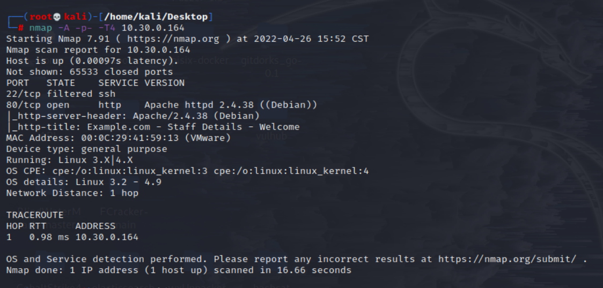

# DC 9

## 环境准备

- 镜像地址：https://www.vulnhub.com/entry/dc-9,412/

## 知识点

## 信息收集

```bash
ifconfig eth0 # 这里是因为本地局域网
nmap -sP 10.30.0.0/24 # IP探测 扫描本地C段的网络端口信息
nmap -A -p- -T4 10.30.0.164
```



## 漏洞利用

## 参考链接

- https://peiqiwiki.yuque.com/staff-ws572w/ku05f9/nbpk5u
- http://www.kxsy.work/2021/07/29/shen-tou-dc-9/
- https://github.com/ffffffff0x/1earn/blob/004fbc731d7ce8004b9c2a38613d39f71cd8cb6e/1earn/Security/%E5%AE%89%E5%85%A8%E8%B5%84%E6%BA%90/%E9%9D%B6%E6%9C%BA/VulnHub/DC/DC9-WalkThrough.md