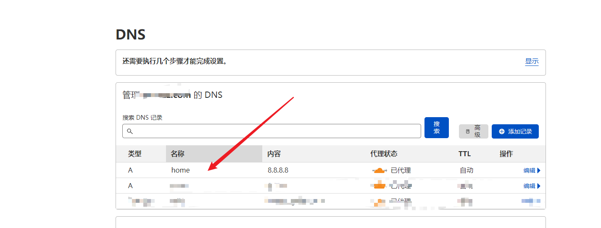
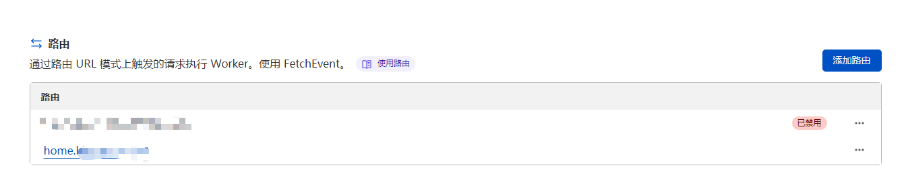
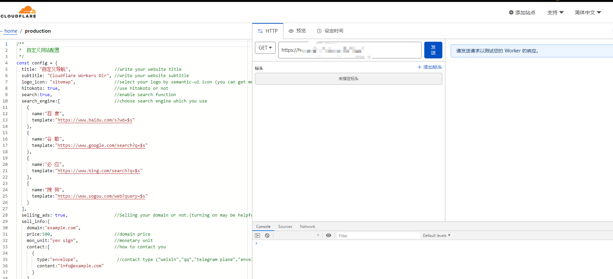

# 搭建导航网站

## 环境准备

- CF-Worker-Dir 的 Github 的开源地址：https://github.com/sleepwood/CF-Worker-Dir/
- CloudFlare Worker ：https://workers.cloudflare.com/

## 配置Workers

1.设置DNS子域名home

2.创建Workder设置路由指向home

3.快速编辑，将开源项目index.js复制到里面

