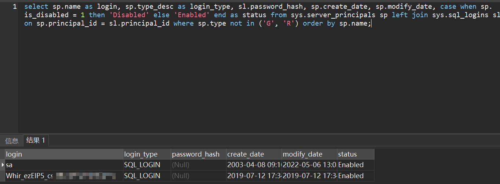

# MSSQL

- [ffffffff0x-1earn-mssql实验](https://github.com/ffffffff0x/1earn/blob/master/1earn/Security/RedTeam/%E8%BD%AF%E4%BB%B6%E6%9C%8D%E5%8A%A1%E5%AE%89%E5%85%A8/%E5%AE%9E%E9%AA%8C/MSSQL.md)
- [跳跳糖社区-rfusd-mssql提权总结](https://tttang.com/archive/1545/)


## 查看登录用户

```
select sp.name as login, sp.type_desc as login_type, sl.password_hash, sp.create_date, sp.modify_date, case when sp.is_disabled = 1 then 'Disabled' else 'Enabled' end as status from sys.server_principals sp left join sys.sql_logins sl on sp.principal_id = sl.principal_id where sp.type not in ('G', 'R') order by sp.name;
```

