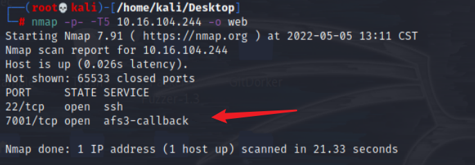
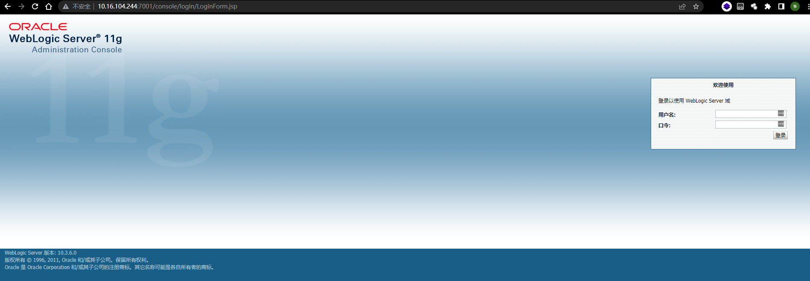
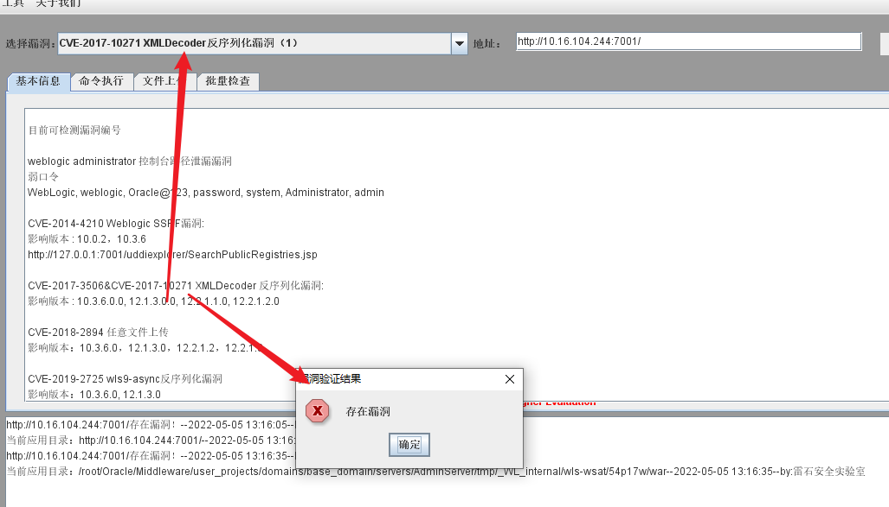
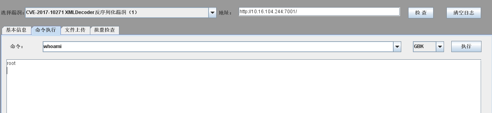
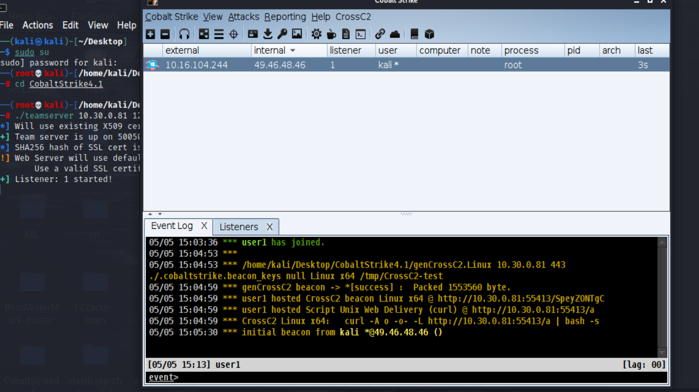

# Oracle-Weblogic

# 人社局应急演练

## 思路

nmap扫描发现7001端口，打开后是oralce weblogic服务，使用weblogicScan工具扫描一下，发现CVE-2017-10271漏洞，该漏洞方便我们拿到shell，再通过该shell进行CS上线

## 相关工具以及命令

- nmap
`nmap -p- -T5 192.168.111.80 -o web`
- https://github.com/rabbitmask/WeblogicScan
`python3 WeblogicScan.py 192.168.111.80 7001`

## 环境搭建

- 环境地址：https://github.com/vulhub/vulhub/tree/b24a89459fbd98ba76881adb6d4e2fb376792863/weblogic/CVE-2017-10271


安装docker
```bash
apt-get install docker docker-compose
```

```bash
cd weblogic/CVE-2017-10271
docker-compose up -d # 不用代理的会有点慢
```


## 攻击方视角

1.攻击方扫描端口发现Oracle Weblogic业务
```bash
nmap -p- -T5 10.16.104.244 -o web
```



访问`http://10.16.104.244:7001/console`



2.尝试用weblogic测试工具扫描，发现存在CVE-2017-10271漏洞



3.漏洞利用成功后，执行常见命令，在攻击方电脑上展示




4.上线CS木马



## 防守方视角

## 参考链接

- https://cdmana.com/2021/12/20211207014823186M.html
- https://github.com/vulhub/vulhub/tree/b24a89459fbd98ba76881adb6d4e2fb376792863/weblogic/CVE-2017-10271