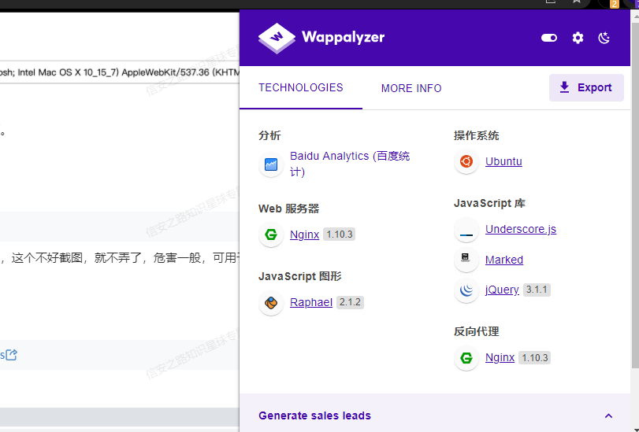

# CMS识别

## 在线平台

- bugscanner：http://whatweb.bugscaner.com/look/
- 数字观星：https://fp.shuziguanxing.com/#/
- 云悉指纹：https://www.yunsee.cn/

## 浏览器插件

工具地址：https://www.wappalyzer.com/

## 离线工具

这几个我还没用过，等后面有机会用了评估下吧

- https://github.com/Tuhinshubhra/CMSeeK
- https://github.com/Dionach/CMSmap
- https://github.com/aedoo/ACMSDiscovery
- https://github.com/TideSec/TideFinger
- https://github.com/Lucifer1993/AngelSword

主要是指纹库的维护和更新