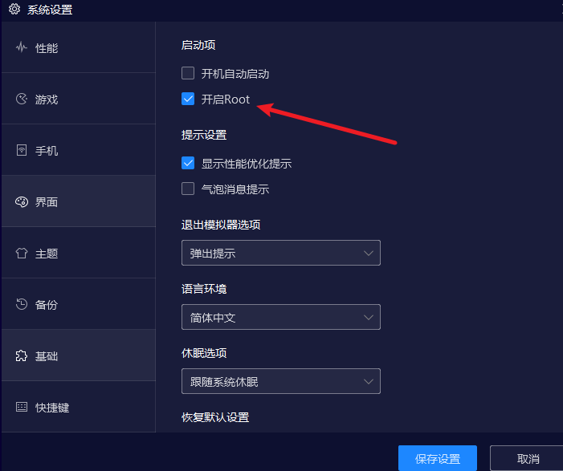

# 小程序反编译环境搭建以及测试

## 前言

之前搞过反编译微信小程序，后来有一段时间没用了，忘记了基本的操作，遇到一些环境问题，这里做一个笔记。

## 获取小程序编译包

**npm环境搭建**

官方地址：https://nodejs.org/zh-cn/download/
```
npm install esprima
npm install css-tree
npm install cssbeautify
npm install vm2
npm install uglify-es
npm install js-beautify
```

- 夜神模拟器：https://www.yeshen.com/
- 右上角-基础设置-开启Root权限
- 下载RE文件管理器(RE管理器rootexplorer)以及微信：https://www.pgyer.com/eznP




- 非模拟器：(这里是我个人的目录，可以在微信设置查看)
- 本地微信小程序默认路径：C:\Users\xxxx\OneDrive\文档\WeChat Files\Applet


获取最新的程序包，`__APP__.wxapkg`是主包，需要解密


UnpackMiniApp.exe 解密对应的__APP__.wxagkg,解密后会默认存储在当前目录wxpack


- 打开微信->搜索微博小程序并打开->切换RE文件管理

```
/data/data/com.tencent.mm/MicroMsg/77966efb022097aed18e0409051ee1d5/appbrand/pkg
```

在如上路径找到对应的程序包(其中长字符串每个人不一样，根据自己情况选择)


## 压缩对应程序包

长按对应的程序包(需要先压缩)，点击右上角发送微信好友，将此文件解压倒指定文件夹下。


## 反编译小程序


- 反编译脚本wxappUnpacker:https://github.com/GxBSXUKing/wxappUnpacker.git

```bash
cd wxappUnpacker
node wuWxapkg.js  _2124628805_228.wxapkg # Windows
./bingo.sh wx0ea382a771798601.wxapkg # linux
```

备注：我Windows下使用会有报错一些东西，linux下正常


可以看到我是在kali下反编译的，成功无报错。

## 微信开发工具

- https://developers.weixin.qq.com/miniprogram/dev/devtools/download.html


备注：微信开发工具可视化成功率挺低的。


## 相关文章

- 相关逆向工具：https://github.com/lixi5338619/lxSpider/blob/7c895b3e813d548336cba1e5736f4f46efbd1848/%E5%B7%A5%E5%85%B7%E4%B8%8B%E8%BD%BD/readme.md
- Windows电脑反编译微信小程序含分包详细操作：https://juejin.cn/post/7002889906582192158
- 漏洞挖掘之小程序反编译接口获取：https://www.yuque.com/gxbsxuking/egy1xm/lpz9n6